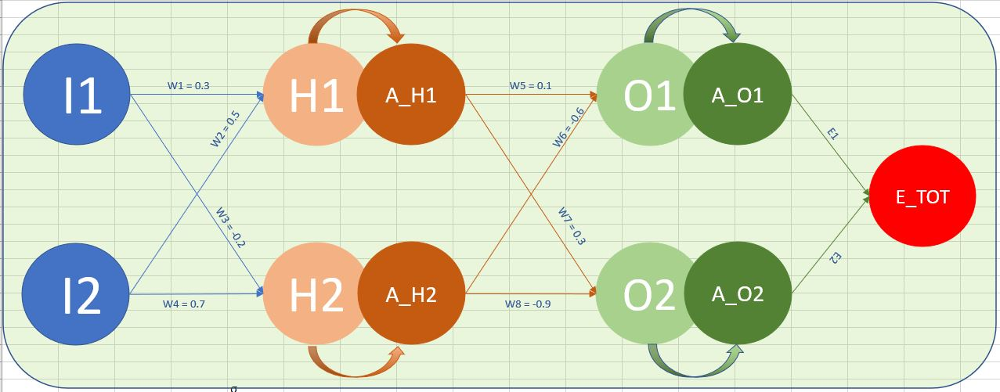
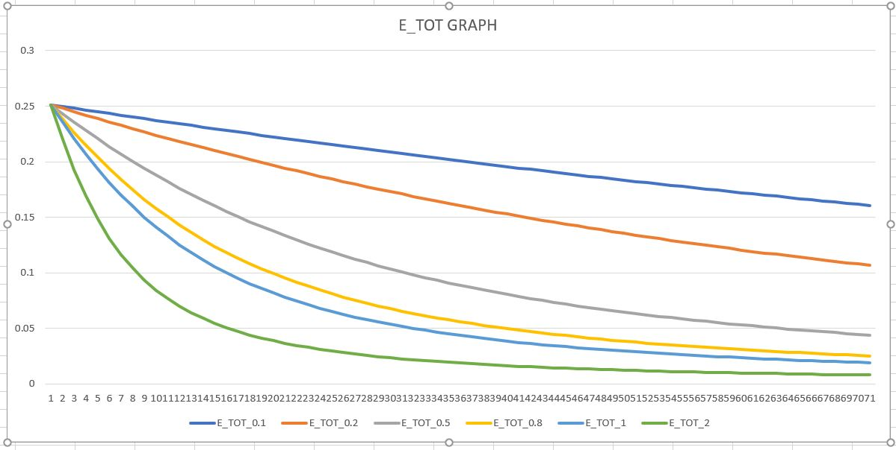
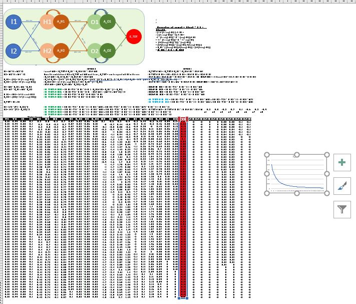

Name: Raghunadh Puranam

Email: raghunadpuranam@gmail.com

Batch details : <>

Session 4 Assignments:

[PART1] - Write the excel sheet with back propagation with inputs and targets as used in the class

I1 = 0.05 I2 = 0.1 (Inputs) & T1 = 0.01 T2 = 0.99 (Outputs)

Weights (updated as specified in the assignment QnA):

W1 = 0.3 , W2 = 0.5 , W3 =-0.2 , W4 = 0.7 , W5 = 0.1 , W6 = -0.6 , W7 = 0.3 , W8 = -0.9

<u>**Explanation:**</u>

Let us start with a simple network with **<u>two</u>** inputs and **<u>two</u>** outputs. Let's say the purpose of this network is to learn and gives the highest number from the inputs. And as you an see with the targets (t2 = 0.99) - it should shout out that I2 is the bigger one.

Let us also use two layers in between and to use standard convention lets call I1 & I2 as input neurons and T1 & T2 as outputs and similarly the neurons in first layer A_H1 & A_H2 and A_01 & A_O2 in second layer.

We will use Mean square error to compute the loss , which will be obviously function of expected output (T1) vs actual output (A_O1). 

E1 = 1/2 * (T1 - A_O1)^2 and similarly for E2 = 1/2 * (T2 - A_O2)^2. The total loss E_TOT will be sum of E1 & E2 (E_TOT = E1 + E2)

And our target will be to minimize E_TOT.

In this two layered network, then input neuron I1 connects to every neuron in the second layer and in-turn this neuron is connected to every other neuron in the next layer. When we say connected each input neuron is associated with a weight corresponding to the neurons it is connected to in the next layer. Why have a weight ? The idea is that these weights be related with our inputs and the networks tunes these weight in every pass and achieve our objective of minimizing E_TOT

With that, we will have #8 weights (parameters) in the above network. And the big question , what should be the initials values of these eight weights?

Like in case of solving any other problem, start somewhere (randomly) !! 

The other section that we haven't talked about is the connected between H1 and A_H1. As the picture represents H1 transforms itself into A_H1 and the sole objective of this is to achieve non-linearity. If you are aware of basic calculus, if the above network is represented as linear equation multiplied with constants like w1, the entire things collapses into one layer (simple equation) and the idea of the sending some feedback in-order to update (modify) the weights to reduce E_TOT (which is our objective) fails. Hence we need a function that translates H1 to A_H1 and achieve non-linearity, which in this case will be sigmoid.

With that introduction, let us step into visualizing how the network will learn in-order to achieve our objective.

Let us start the calculations at the output of layer 1 first and we will extend the same to second layer

H1 = W1*I1 + W2*I2																												O1 = W5*A_H1 + W6*A_H2

H2 = W3*I1 + W4*I2																												O2 = W7*A_H1 + W8*A_H2

A_H1 = σ(H1) = 1/(1 + exp(-H1))																						A_O1 = σ(O1) = 1/(1 + exp(-O1))

A_H2 = σ(H2) = 1/(1 + exp(-H2))																						A_O2 = σ(O2) = 1/(1 + exp(-O2))

With the above feed forward equations if we compute the E_TOT it would be,

| T1   | T2   | I1   | I2   | W1   | W2   | W3   | W4   | H1    | A_H1     | H2   | A_H2     | W5   |
| ---- | ---- | ---- | ---- | ---- | ---- | ---- | ---- | ----- | -------- | ---- | -------- | ---- |
| 0.01 | 0.99 | 0.05 | 0.1  | 0.3  | 0.5  | -0.2 | 0.7  | 0.065 | 0.516244 | 0.06 | 0.514996 | 0.1  |

| W6   | W7   | W8   | O1       | A_O1    | O2       | A_O2     | E1       | E2       | E_TOT               |
| ---- | ---- | ---- | -------- | ------- | -------- | -------- | -------- | -------- | ------------------- |
| -0.6 | 0.3  | -0.9 | -0.25737 | 0.43601 | -0.30862 | 0.423451 | 0.090742 | 0.160489 | <u>**0.251231**</u> |

With that, we finished one pass of feed forward network. Now the idea is we compute the next set of weight such that we will reduce the E_TOT component. In mathematics, if you are at a point in 3-D space and would like to move towards local minima (which is E_TOT) in this case, you should identify small steps in such a way that you would move in the direction of local minima. In order to compute the step (which is called gradient) we compute the derivative of the function with respect to the parameter we would like to update (tune)

So our objective would be to compute the derivative of ∂E_TOT w.r.t to all the weights which would be,

∂E_TOT/∂W1 , ∂E_TOT/∂W2 , ∂E_TOT/∂W3 ...... ∂E_TOT/∂W8 in order to get the new set of weights which would minimize our E_TOT.

Let us compute the derivative of ∂E_TOT w.r.t W5,W6,W7,W8 and then come back to W1,W2,W3,W4

If we traverse the path backwards, we can see that contribution of E2 towards W5 will be zero and similarly for W6. Extending this, the contribution of E1 towards W7 & W8 would be zero.

So, ∂E_TOT/∂W5 = ∂E1/∂W5 and ∂E_TOT/∂W6 = ∂E1/∂W6. Similarly ∂E_TOT/∂W7 = ∂E2/∂W7 and ∂E_TOT/∂W8 = ∂E2/∂W8.

Let us compute ∂E1/∂W5 and extend it to others,

We can represent ∂E_1/∂W5 as,

**∂E_1/∂W5 = ∂E_1/∂A_O1 * ∂A_O1/∂O1 * ∂O1/∂W5**

And let's compute each component individually,

**∂E_1/∂A_O1** 	= ∂(1/2 * (t1-A_01)^2)/∂A_O1

​						  = ∂(1/2 * (t1^2 + A_O1^2 - 2 * A_O1 * t1)/∂A_O1 

​						  = 1/2 * (  0 + 2*A_O1 -2 * t1) 

​						  = (A_O1 - t1)

**∂A_O1/∂O1** = ∂( 1 / (1 + exp(-O1) ) / ∂O1 = A_O1 * ( 1 - A_O1)

The derivate of sigmoid will be function of sigmoid itself = (sigmoid  * ( 1 - sigmoid))

Proof for above equation:

∂( 1 / (1 + exp(-O1) ) / ∂O1  = ∂ ( (1 + exp(-O1))^ -1) / ∂O1

= -1 * (1 + exp(-O1))^-2 * ∂(exp(-O1))/∂O1 

= -1 *  (1 + exp(-O1))^-2 * -1 * exp(-O1) 

=  1/(1+exp(-O1))^2) * exp(-O1)

= exp(-O1) / ( (1+exp(-O1) * (1+exp(-O1)) )

= 1/(1 + exp(-O1))  * exp(-O1) / (1 + exp(-O1))

= A_O1 * ( (1+exp(-O1))/(1+exp(-O1)) - (1/(1+exp(-O1))

= A_O1 * ( 1 - A_O1)

and finally,

**∂O1/∂W5** = ∂(W5*A_H1 +W6 * A_H2)/∂W5 = A_H1

With the above three components solved we would have,

**∂E_1/∂W5 = ∂E_TOT/∂W5 = (A_O1 - t1) * A_O1 * ( 1 - A_O1)  * A_H1**

Extending the same to other parameters in the network,

**∂E_TOT/∂W6 = (A_O1 -T1) * A_O1 * (1-A_O1) * A_H2**

**∂E_TOT/∂W7 = (A_O2 -T2) * A_O2 * (1-A_O2) * A_H1**

**∂E_TOT/∂W8 = (A_O2 -T2) * A_O2 * (1-A_O2) * A_H2**

With that we completed the computation required for updating one layer of network in the reverse direction. Now we should extend our ability to do the same for the other one

The other piece that's left over is the computation of gradient with respect to W1,W2,W3 & W4

So like we did with W5 and extended to other weights in the layers, let's do the same for W1 and we will extend it to others. Build your intuition :) !!

Similarly we can represent ∂E_TOT/∂W1 as below,

**∂E_TOT/∂W1 = ∂E_TOT/∂A_H1 * ∂A_H1/∂H1 * ∂H1/∂W1**

let us compute each individual components separately again,

∂E_TOT/∂A_H1 = ∂(E1 + E2) / ∂A_H1 = ∂E1/∂A_H1 + ∂E2/∂A_H1

Let's again do it for ∂E1/∂A_H1 and extend it to  ∂E2/∂A_H2 

∂E1/∂A_H1 = ∂E1/∂A_O1 * ∂A_O1/∂O1 * ∂O1/∂A_H1

Re-using the values of ∂E1/∂A_O1, ∂A_O1/∂O1 from above and ∂O1/∂A_H1 = ∂(W5 * A_H1 + W6 * A_H2)/∂A_H1 = W5

∂E1/∂A_H1 = (A_O1 - T1) *  A_O1 * ( 1 - A_O1) * W5. Extending this to all others, we would get

∂E1/∂A_H2 = (A_O1 - T1) *  A_O1 * ( 1 - A_O1) * W6

∂E2/∂A_H1 = (A_O2 - T2) *  A_O2 * ( 1 - A_O2) * W7

∂E2/∂A_H2 = (A_O2 - T2) *  A_O2 * (1 - A_O2) * W8

Using the fact that E_TOT = E1 + E2 , let us complete the above for E_TOT

**∂E_TOT/∂A_H1** = ((A_O1 - T1) *  A_O1 * ( 1 - A_O1) * W5) + ((A_O2 - T2) *  A_O2 * ( 1 - A_O2) * W7)

**∂E_TOT/∂A_H2** = ((A_O1 - T1) *  A_O1 * ( 1 - A_O1) * W6) + ((A_O2 - T2) *  A_O2 * (1 - A_O2) * W8)

We are left with ∂A_H1/∂H1 * ∂H1/∂W1 in the equation **∂E_TOT/∂W1 = ∂E_TOT/∂A_H1 * <u>∂A_H1/∂H1 * ∂H1/∂W1</u>**

**∂A_H1/∂H1** = A_H1 * ( 1 - A_H1) [Using the principle of derivative of sigmoid function]

**∂H1/∂W1** = ∂ (W1*I1 + W2*I2) = I1

And after so many calculations we arrive at our gradient w.r.t W1 and extending it others we will have,

**<u>∂E_TOT/∂W1 = ((A_O1 - T1) *  A_O1 * ( 1 - A_O1) * W5) + ((A_O2 - T2) *  A_O2 * ( 1 - A_O2) * W7) * A_H1 * ( 1 - A_H1) * I1</u>**

**<u>∂E_TOT/∂W2 = ((A_O1 - T1) *  A_O1 * ( 1 - A_O1) * W5) + ((A_O2 - T2) *  A_O2 * ( 1 - A_O2) * W7) * A_H1 * ( 1 - A_H1) * I2</u>**

**<u>∂E_TOT/∂W3 = ((A_O1 - T1) *  A_O1 * ( 1 - A_O1) * W6) + ((A_O2 - T2) *  A_O2 * ( 1 - A_O2) * W8) * A_H2 * ( 1 - A_H2) * I1</u>**

**<u>∂E_TOT/∂W4 = ((A_O1 - T1) *  A_O1 * ( 1 - A_O1) * W6) + ((A_O2 - T2) *  A_O2 * ( 1 - A_O2) * W8) * A_H2 * ( 1 - A_H2) * I2</u>**

Now that we have the steps to nudge these parameters and give them their new values so that we will minimize our loss E_TOT, lets see the updated weights.

There is another parameter that is introduced while updating the weights, which we call the **<u>Learning rate</u>**(θ). The idea is we multiply the gradient descent we arrive after the calculation that we above with constant factor instead of substracting them directly from the original weights. So this parameter defined the step size (constant) value that will be multiplied with the calculated gradients. This also kind of determines how fast/slow (step size) the weights are to be updated in order to minimize the loss. So with that introduction the new weights will be,

W1_NEW = W1 - ( θ  * ∂E_TOT/∂W1)							W5_NEW = W5 - ( θ  * ∂E_TOT/∂W5)

W2_NEW = W2 - ( θ  * ∂E_TOT/∂W2)							W6_NEW = W6 - ( θ  * ∂E_TOT/∂W6)

W3_NEW = W3 - ( θ  * ∂E_TOT/∂W3)							W7_NEW = W7 - ( θ  * ∂E_TOT/∂W7)

W4_NEW = W4 - ( θ  * ∂E_TOT/∂W4)							W8_NEW = W8 - ( θ  * ∂E_TOT/∂W8)

With θ =1 , and from the above resultant equation, let us look at the new loss - 

| T1   | T2   | I1   | I2   | W1       | W2       | W3       | W4       | H1       | A_H1     | H2       | A_H2     | W5       |
| ---- | ---- | ---- | ---- | -------- | -------- | -------- | -------- | -------- | -------- | -------- | -------- | -------- |
| 0.01 | 0.99 | 0.05 | 0.1  | 0.3      | 0.5      | -0.2     | 0.7      | 0.065    | 0.516244 | 0.06     | 0.514996 | 0.1      |
| 0.01 | 0.99 | 0.05 | 0.1  | 0.300387 | 0.500775 | -0.20077 | 0.698461 | 0.065097 | 0.516268 | 0.059808 | 0.514947 | 0.045919 |

| W6       | W7       | W8       | O1       | A_O1     | O2       | A_O2     | E1       | E2       | E_TOT               |
| -------- | -------- | -------- | -------- | -------- | -------- | -------- | -------- | -------- | ------------------- |
| -0.6     | 0.3      | -0.9     | -0.25737 | 0.43601  | -0.30862 | 0.423451 | 0.090742 | 0.160489 | **<u>0.251231</u>** |
| -0.65395 | 0.371406 | -0.82877 | -0.31304 | 0.422372 | -0.23503 | 0.441512 | 0.085025 | 0.150419 | <u>**0.235445**</u> |

So, with one pass of feedback we have reduced out loss from **<u>0.251231</u>** --> <u>**0.235445**</u>

You repeat this process over multiple passes, the error will keep coming down. Magic :)

The impact of using different learning rate values for the above network can be seen in the below image. Note the trajectory with which the error goes down as you increase the learning rate. The impact of learning rate and its repercussions will be established in the later part of the course.

**<u>E_TOT CHANGE VS LEARNING RATE</u>**

**SCREENSHOT (MICRO SIZE VERSION) OF EXCEL SHEET**

