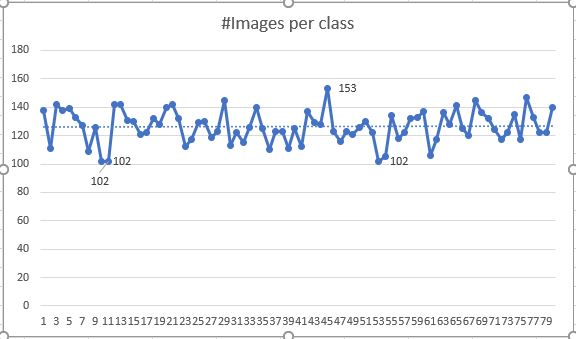

Name: Raghunadh Puranam

Email: raghunadpuranam@gmail.com

Group: NA

Assignment No: 10

PART: A

PART: B

1. Class distribution
   1. There are total of 80 classes based on the id label
2. Format of the input bbox
   1. Comparison of every number against height of the images rules out 1st,4th as Y co-ordinates (since object box cannot be > image itself)
   2. 1,4 are y co-ordinates (the smallest being y1 & bigger will be y2)
   3. 2,3 are x co-ordinates (the smallest being x1 & bigger will be x2)
3. Processed input with above conditions
   1. Images per class (Min:102, Max:153)

