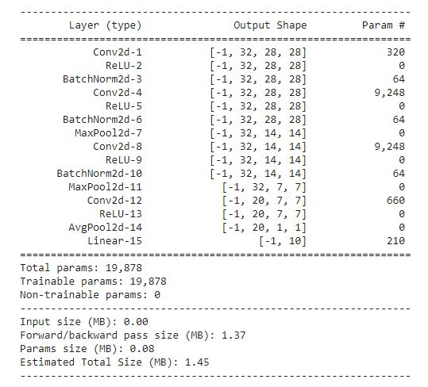

Session4 : PART2:

I tried applying the concepts explained in the class. I have three blocks in my network. Since the #params were constrained I restricted the max number of channels used in convolution is 32

BLock1:

self.conv1 = nn.Sequential(

​      nn.Conv2d(1, 32, 3, padding=1),

​      nn.ReLU(),

​      nn.BatchNorm2d(32),

​      nn.Conv2d(32, 32, 3, padding=1),

​      nn.ReLU(),

​      nn.BatchNorm2d(32),

​      nn.MaxPool2d(2, 2)

 )

Hit receptive field of 5x5 atleast using two 3x3x32 kernels.

Then apply max pooling

Block2:

self.conv2 = nn.Sequential(

​      nn.Conv2d(32, 32, 3, padding=1),

​      nn.ReLU(),

​      nn.BatchNorm2d(32),

​      nn.MaxPool2d(2, 2)

​    )

  Perform convolution again and then jump to max pooling 

Block3:

Use transition layer to conver 7x7x32 into 7x7x20 (tried 7x7x10) with 1x1x20 convolution

Use the gap layer to to convert into 1d and pass to Fully connected layer

​    self.conv3 = nn.Sequential(

​      nn.Conv2d(32, 20, 1),

​      nn.ReLU(),

​      nn.AvgPool2d(7)

​    )

​    \#7x7x10

​    self.fc = nn.Sequential(

​      nn.Linear(20, 10)

​    )

Accuracy :

Test set: Average loss: 0.0561, Accuracy: 9839/10000 (98.4%)

have explored Dropout/Learning rate as well

##No of parameters

