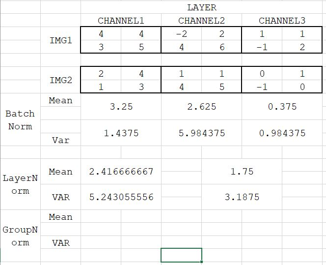
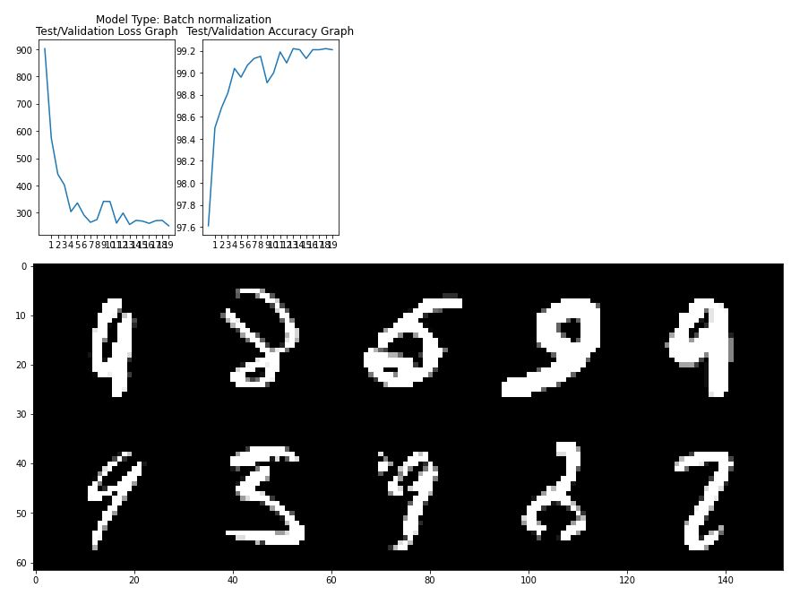
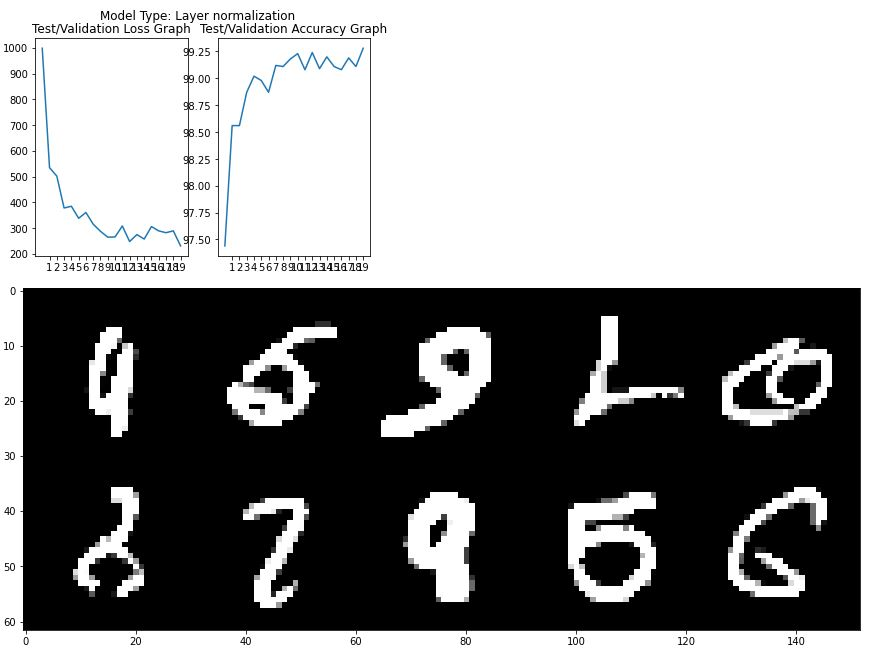
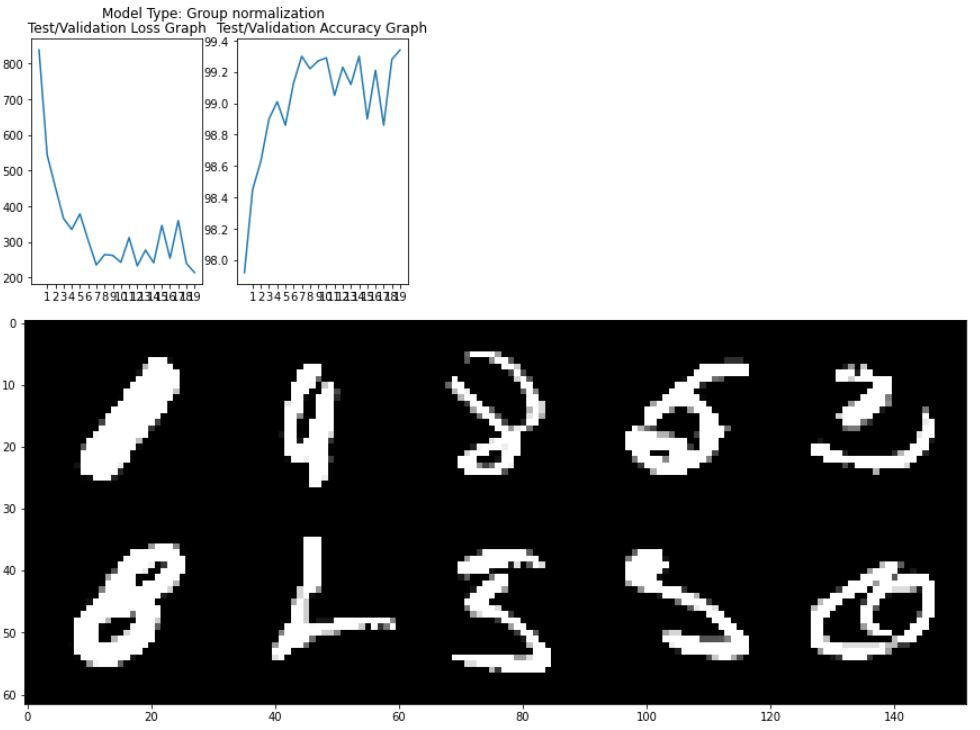

Name: Raghunadh Puranam

Email: raghunadpuranam@gmail.com

Group: NA

**What is your code all about ?**

1. Take my CODE from previous assignment - Was using BatchNorm, Dropout earlier 
2. Split it into blocks
   1. Basic Setup & Data Loading block
   2. Extended to add L1 loss to the total loss.
      1. Experimented with lambda values. Some details on how I arrived at the lambda at the bottom of this README
   3. Definitions of three models using BatchNorm, LayerNorm, GroupNorm
   4. Define train and test definitions
   5. Final **MAIN** block which has two functions
      1. MAIN(INPUT_MODEL_TYPE,EPOCHS) -> Specify the type of model to chose
      2. run_train_test(model,epochs) -> Performs the training and validation & write outs
         1. Model Summary
         2. Test Loss/Accuracy Plots
         3. Grid Image of 5x2 for misinterpreted images

**How to perform 3 normalizations explained in the class**

This question is slightly unclear to me , but I will try to answer theoretically and logistically

Logistics - nn.GroupNorm to implement both layer normalization (with 1 group) and specify the number of groups for group normalization, with the requirement being the number of groups have to be divisible with number of channels

Explanation:

**Image Normalization** :  Technique to convert the range of input image to the entire spectrum

If you have an image with values of 20 to 100 in the scale ( 0 to 255) , you basically modify it to gaussian distribution and have the values ranging from 0 to 255

**Image Equalization:** Different from Image Normalization - this just ensures that there are equal number of pixels (histogram) at each pixel intensities of the input image

**Batch Normalization:** Same as normalization , except that we do it over batch of images

Let us say, I have batch of 128 images and all of them will be in memory at once on the GPU.

Lets us say we are at layer in our network which has 3 output channels and say the size of our image is 2x2 (will implement for just two images)

For batch norm - we take the mean of all the pixels in a channel for all images and also compute the variance
$$
X = MEAN / SQRT(VAR + E)
$$

$$
Y = AX + B
$$

Where A , B  in the above equation are equivalent of Gamma & Beta (in regular convention) and are left to be figured by NN so that it can decide to discard or let the normalization take effect instead of us enforcing

**Layer Normalization**

Unfortunately not intuitive from the below image , but instead of doing it for all channels channel, we now do it from an image in the entire layer

**Group Normalization:**

This is kind of middle ground , where we group some channels within an image and apply the same instead of single one for whole layer.

I didn't fill it for Group, since I have picked an odd channels and grouping in pytorch context can't be done for such configuration.

But in-theory create 3 groups and normalize them independently instead of single for the entire layer




**Observations / Findings on implementing 3 methods**

1. Batch Normalization:
   1. Best Train Accuracy: 99.03 (20th epoch)
   2. Best Test Accuracy: 99.22 (consistent in the last 4 epochs)
2. Layer Normalization:
   1. Best Train Accuracy: 98.94 (20th epoch)
   2. Best Test Accuracy: 99.28 (20th , 2nd best - 99.24 12th epoch)
   3. Least train accuracy. Does lesser parameters of Y,Beta explain this ?
3. Group Normalization:
   1. Best Train Accuracy: 99.02 (20th epoch)
   2. Best Test Accuracy: 99.34 (20th epoch) , 2nd best - 99.3 (7th & 14th epoch)
   3. The fluctuation in model performance was higher than other two between successive epochs
4. Among 3 , batch norm had consistent reduction of loss as it progressed
5. I would take the model with BatchNorm on this data for its consistency

**PLOTS & MIS-QUALIFIED IMAGES**










**APPLY L1 LOSS:**

Take the best model from S5 and use Batch norm & L1 loss.

Before L1 LOSS:

```
EPOCH: 10
Loss=0.06356414407491684 Batch_id=468 Accuracy=98.97: 100%|██████████| 469/469 [00:36<00:00, 12.86it/s]
  0%|          | 0/469 [00:00<?, ?it/s]
Test set: Average loss: 0.0254, Accuracy: 9924/10000 (99.24%)

EPOCH: 11
Loss=0.017373524606227875 Batch_id=468 Accuracy=99.11: 100%|██████████| 469/469 [00:36<00:00, 12.89it/s]
  0%|          | 0/469 [00:00<?, ?it/s]
Test set: Average loss: 0.0228, Accuracy: 9932/10000 (99.32%)

EPOCH: 12
Loss=0.012348306365311146 Batch_id=468 Accuracy=99.03: 100%|██████████| 469/469 [00:36<00:00, 12.81it/s]
  0%|          | 0/469 [00:00<?, ?it/s]
Test set: Average loss: 0.0249, Accuracy: 9924/10000 (99.24%)

EPOCH: 13
Loss=0.017870107665657997 Batch_id=468 Accuracy=99.09: 100%|██████████| 469/469 [00:36<00:00, 12.87it/s]
  0%|          | 0/469 [00:00<?, ?it/s]
Test set: Average loss: 0.0222, Accuracy: 9931/10000 (99.31%)

EPOCH: 14
Loss=0.0374867282807827 Batch_id=468 Accuracy=99.10: 100%|██████████| 469/469 [00:36<00:00, 12.78it/s]
Test set: Average loss: 0.0233, Accuracy: 9928/10000 (99.28%)
```


Adding L1 loss with lamda = 0.001

 Sum of weights was around 600 after first batch. L1 = 600/1000 = 0.6

```
  0%|          | 0/469 [00:00<?, ?it/s]
EPOCH: 0
Loss=0.560316801071167 Batch_id=468 Accuracy=87.59: 100%|██████████| 469/469 [00:28<00:00, 16.69it/s]
  0%|          | 0/469 [00:00<?, ?it/s]
Test set: Average loss: 0.1170, Accuracy: 9724/10000 (97.24%)

EPOCH: 1
Loss=0.4088200628757477 Batch_id=468 Accuracy=97.18: 100%|██████████| 469/469 [00:27<00:00, 16.75it/s]
  0%|          | 0/469 [00:00<?, ?it/s]
Test set: Average loss: 0.1279, Accuracy: 9638/10000 (96.38%)

EPOCH: 2
Loss=0.36337172985076904 Batch_id=468 Accuracy=97.45: 100%|██████████| 469/469 [00:27<00:00, 16.85it/s]
  0%|          | 0/469 [00:00<?, ?it/s]
Test set: Average loss: 0.0851, Accuracy: 9749/10000 (97.49%)

EPOCH: 3
Loss=0.36339420080184937 Batch_id=468 Accuracy=97.56: 100%|██████████| 469/469 [00:28<00:00, 16.75it/s]
  0%|          | 0/469 [00:00<?, ?it/s]
Test set: Average loss: 0.0782, Accuracy: 9785/10000 (97.85%)

EPOCH: 4
Loss=0.4292565584182739 Batch_id=468 Accuracy=97.63: 100%|██████████| 469/469 [00:27<00:00, 16.93it/s]
  0%|          | 0/469 [00:00<?, ?it/s]
Test set: Average loss: 0.0564, Accuracy: 9817/10000 (98.17%)

EPOCH: 5
Loss=0.39735323190689087 Batch_id=468 Accuracy=97.67: 100%|██████████| 469/469 [00:27<00:00, 16.91it/s]
  0%|          | 0/469 [00:00<?, ?it/s]
Test set: Average loss: 0.0805, Accuracy: 9779/10000 (97.79%)

EPOCH: 6
Loss=0.34794187545776367 Batch_id=468 Accuracy=97.58: 100%|██████████| 469/469 [00:27<00:00, 16.98it/s]
  0%|          | 0/469 [00:00<?, ?it/s]
Test set: Average loss: 0.0663, Accuracy: 9820/10000 (98.20%)

EPOCH: 7
Loss=0.2999301254749298 Batch_id=468 Accuracy=97.69: 100%|██████████| 469/469 [00:27<00:00, 16.87it/s]
  0%|          | 0/469 [00:00<?, ?it/s]
Test set: Average loss: 0.1184, Accuracy: 9638/10000 (96.38%)

EPOCH: 8
Loss=0.3719368875026703 Batch_id=468 Accuracy=97.71: 100%|██████████| 469/469 [00:27<00:00, 16.95it/s]
  0%|          | 0/469 [00:00<?, ?it/s]
Test set: Average loss: 0.0629, Accuracy: 9813/10000 (98.13%)

EPOCH: 9
Loss=0.3073998689651489 Batch_id=468 Accuracy=97.72: 100%|██████████| 469/469 [00:27<00:00, 16.93it/s]
  0%|          | 0/469 [00:00<?, ?it/s]
Test set: Average loss: 0.0572, Accuracy: 9833/10000 (98.33%)

EPOCH: 10
Loss=0.3540908694267273 Batch_id=468 Accuracy=97.69: 100%|██████████| 469/469 [00:27<00:00, 16.95it/s]
  0%|          | 0/469 [00:00<?, ?it/s]
Test set: Average loss: 0.0617, Accuracy: 9808/10000 (98.08%)

EPOCH: 11
Loss=0.32088300585746765 Batch_id=468 Accuracy=97.72: 100%|██████████| 469/469 [00:27<00:00, 16.87it/s]
  0%|          | 0/469 [00:00<?, ?it/s]
Test set: Average loss: 0.0531, Accuracy: 9858/10000 (98.58%)

EPOCH: 12
Loss=0.2938636541366577 Batch_id=468 Accuracy=97.69: 100%|██████████| 469/469 [00:27<00:00, 16.93it/s]
  0%|          | 0/469 [00:00<?, ?it/s]
Test set: Average loss: 0.0723, Accuracy: 9771/10000 (97.71%)

EPOCH: 13
Loss=0.2872796058654785 Batch_id=468 Accuracy=97.83: 100%|██████████| 469/469 [00:27<00:00, 16.82it/s]
  0%|          | 0/469 [00:00<?, ?it/s]
Test set: Average loss: 0.0758, Accuracy: 9770/10000 (97.70%)

EPOCH: 14
Loss=0.32212042808532715 Batch_id=468 Accuracy=97.70: 100%|██████████| 469/469 [00:27<00:00, 16.89it/s]
Test set: Average loss: 0.0552, Accuracy: 9852/10000 (98.52%)
```

Observation : Hit on the training accuracy. It did not cross 97.83. Even on the test side the accuracy achieved was like one time hero.

It hit 98.58 and the next epoch it just tumbles down to 97.91. Seems like the change over epoch is high when we use L1

Sum of weights was around 600 after first batch. L1 = 600/10000 = 0.06

```
  0%|          | 0/469 [00:00<?, ?it/s]
EPOCH: 0
Loss=0.14688104391098022 Batch_id=468 Accuracy=87.25: 100%|██████████| 469/469 [00:27<00:00, 17.14it/s]
Test set: Average loss: 0.1011, Accuracy: 9742/10000 (97.42%)
```

Sum of weights was around 600 after first batch. L1 = 600/100000 = 0.006. Obvious but just an observation - as we enforce L1 close to zero with lambda its effect nullifies**. I think on this we can tune it in the range starting from 0.0001**  and above

```
  0%|          | 0/469 [00:00<?, ?it/s]
EPOCH: 0
Loss=0.17509743571281433 Batch_id=468 Accuracy=87.83: 100%|██████████| 469/469 [00:28<00:00, 16.68it/s]
Test set: Average loss: 0.0956, Accuracy: 9743/10000 (97.43%)
```

**Last 5 epochs with 0.0001 value for lambda**

```
EPOCH: 10
Loss=0.09721453487873077 Batch_id=468 Accuracy=98.83: 100%|██████████| 469/469 [00:28<00:00, 16.50it/s]
  0%|          | 0/469 [00:00<?, ?it/s]
Test set: Average loss: 0.0247, Accuracy: 9928/10000 (99.28%)

EPOCH: 11
Loss=0.09725664556026459 Batch_id=468 Accuracy=98.86: 100%|██████████| 469/469 [00:27<00:00, 16.95it/s]
  0%|          | 0/469 [00:00<?, ?it/s]
Test set: Average loss: 0.0311, Accuracy: 9907/10000 (99.07%)

EPOCH: 12
Loss=0.06912263482809067 Batch_id=468 Accuracy=98.87: 100%|██████████| 469/469 [00:27<00:00, 16.95it/s]
  0%|          | 0/469 [00:00<?, ?it/s]
Test set: Average loss: 0.0236, Accuracy: 9925/10000 (99.25%)

EPOCH: 13
Loss=0.09434422850608826 Batch_id=468 Accuracy=98.97: 100%|██████████| 469/469 [00:27<00:00, 16.76it/s]
  0%|          | 0/469 [00:00<?, ?it/s]
Test set: Average loss: 0.0259, Accuracy: 9918/10000 (99.18%)

EPOCH: 14
Loss=0.09924051910638809 Batch_id=468 Accuracy=98.91: 100%|██████████| 469/469 [00:27<00:00, 16.81it/s]
Test set: Average loss: 0.0248, Accuracy: 9926/10000 (99.26%)
```

**Summary for BATCHNORM + L1 LOSS**

1. We can see the addition of L1 lowering the training accuracy and pushing the model to learn ( differently - only in the positive direction ? Answer: No :))
2. Choose bad value for hyper parameter it will screw up the model performance
3. In first case where lambda = 0.001 , we see the test accuracy dropping and volatile
4. With lambda = 0.0001 , we see slight drop in training accuracy just the behavior of regularization with test being near the same as earlier on this dataset