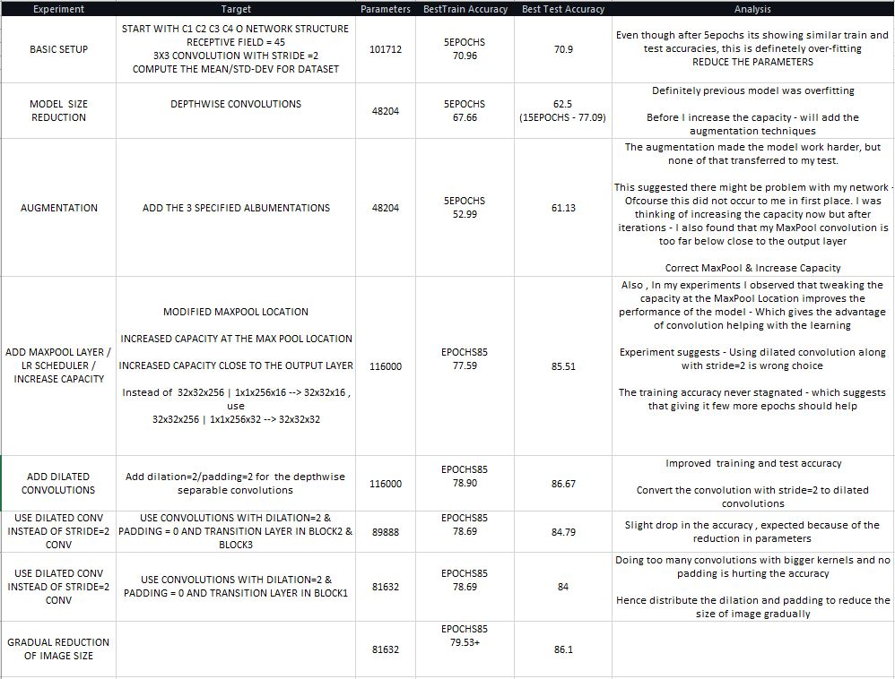
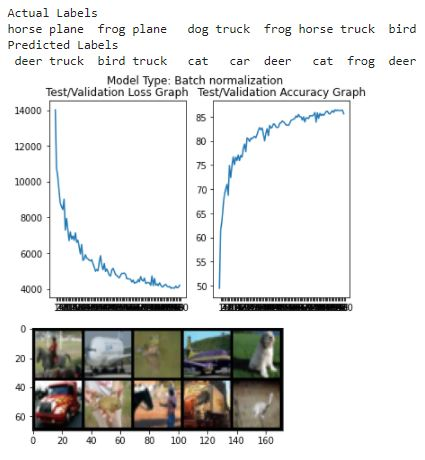
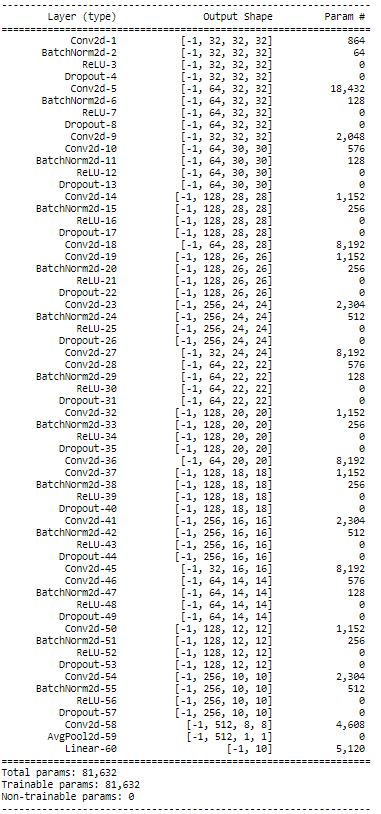

Name: Raghunadh Puranam

Email: raghunadpuranam@gmail.com

ASSIGNMENT TYPE = EARLY

**PARAMETERS: 81632**

**USE DILATED KERNELS INSTEAD OF MP/STRIDE = 2 Convolutions**

**Best Train Accuracy:** 80.11

**Best Test Accuracy:** 86.43

**PLOTS:**

**PARAMS: 81632**

