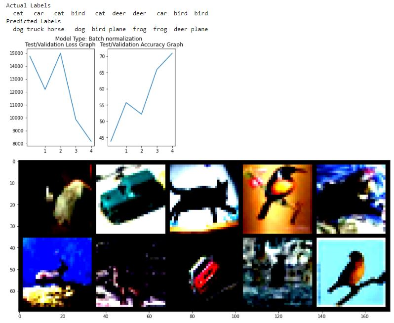

Name: Raghunadh Puranam

Email: raghunadpuranam@gmail.com

ASSIGNMENT TYPE = EARLY

**CODE1:**

- **CALCULATED MEAN & STD DEV FOR 3 CHANNELS AND USED THAT**

- DECENT SIZED NETWORK

- 3x3 Convolution with stride = 2 INSTEAD OF MP

- CROSS ENTROPY + L1 LOSS

- RECEPTIVE FIELD = 45

- NO DILATED CONVOLUTION / NO DEPTHWISE SEPARABLE CONVOLUTION

- PARAMETERS :  101712

  

```
EPOCH: 0
Loss=1.6883418560028076 Batch_id=390 Accuracy=36.41: 100%|██████████| 391/391 [00:15<00:00, 25.97it/s]
  0%|          | 0/391 [00:00<?, ?it/s]
Test set: Average loss: 14763.0356, Accuracy: 4379/10000 (43.79%)

EPOCH: 1
Loss=1.5551093816757202 Batch_id=390 Accuracy=55.90: 100%|██████████| 391/391 [00:14<00:00, 26.38it/s]
  0%|          | 0/391 [00:00<?, ?it/s]
Test set: Average loss: 12177.5930, Accuracy: 5574/10000 (55.74%)

EPOCH: 2
Loss=1.4456286430358887 Batch_id=390 Accuracy=63.30: 100%|██████████| 391/391 [00:14<00:00, 26.22it/s]
  0%|          | 0/391 [00:00<?, ?it/s]
Test set: Average loss: 14978.6257, Accuracy: 5215/10000 (52.15%)

EPOCH: 3
Loss=1.2669501304626465 Batch_id=390 Accuracy=67.66: 100%|██████████| 391/391 [00:14<00:00, 26.58it/s]
  0%|          | 0/391 [00:00<?, ?it/s]
Test set: Average loss: 9855.4496, Accuracy: 6591/10000 (65.91%)

EPOCH: 4
Loss=1.1079049110412598 Batch_id=390 Accuracy=70.96: 100%|██████████| 391/391 [00:14<00:00, 26.27it/s]
Clipping input data to the valid range for imshow with RGB data ([0..1] for floats or [0..255] for integers).
Test set: Average loss: 8158.7519, Accuracy: 7090/10000 (70.90%)
```

PLOTS / MIS QUALIFICATION




**CODE2:** CODE1 +

- ADDED DILATED CONVOUTION IN ONE LAYER
- **MODIFIED CONV BLOCKS TO DEPTHWISE TO START WITH**
- DROP IN ACCURACY AS EXPECTED
- **PARAMS: 48204**
- **Continuing for 15epochs gives - 77.09 Test Accuracy**

```
EPOCH: 0
Loss=1.7044098377227783 Batch_id=390 Accuracy=34.10: 100%|██████████| 391/391 [00:14<00:00, 27.44it/s]
  0%|          | 0/391 [00:00<?, ?it/s]
Test set: Average loss: 14075.3611, Accuracy: 4692/10000 (46.92%)

EPOCH: 1
Loss=1.3853843212127686 Batch_id=390 Accuracy=52.69: 100%|██████████| 391/391 [00:14<00:00, 27.75it/s]
  0%|          | 0/391 [00:00<?, ?it/s]
Test set: Average loss: 12377.8733, Accuracy: 5560/10000 (55.60%)

EPOCH: 2
Loss=1.2151840925216675 Batch_id=390 Accuracy=60.39: 100%|██████████| 391/391 [00:14<00:00, 27.75it/s]
  0%|          | 0/391 [00:00<?, ?it/s]
Test set: Average loss: 12875.3105, Accuracy: 5389/10000 (53.89%)

EPOCH: 3
Loss=1.1957571506500244 Batch_id=390 Accuracy=64.46: 100%|██████████| 391/391 [00:13<00:00, 27.95it/s]
  0%|          | 0/391 [00:00<?, ?it/s]
Test set: Average loss: 9942.4109, Accuracy: 6511/10000 (65.11%)

EPOCH: 4
Loss=1.0937849283218384 Batch_id=390 Accuracy=67.66: 100%|██████████| 391/391 [00:14<00:00, 27.59it/s]
  0%|          | 0/391 [00:00<?, ?it/s]
Test set: Average loss: 10436.1303, Accuracy: 6250/10000 (62.50%)
```


**CODE3:** CODE2 +

- **Implemented Albumentations**
- **PARAMS: 48204**
- **Continuing for 20 epochs gives - 72.81% (epoch 19) Test Accuracy**

EPOCH: 0
Loss=1.9606297016143799 Batch_id=390 Accuracy=28.60: 100%|██████████| 391/391 [00:12<00:00, 30.38it/s]
  0%|          | 0/391 [00:00<?, ?it/s]
Test set: Average loss: 16115.0213, Accuracy: 3781/10000 (37.81%)

EPOCH: 1
Loss=1.6069353818893433 Batch_id=390 Accuracy=41.65: 100%|██████████| 391/391 [00:12<00:00, 30.49it/s]
  0%|          | 0/391 [00:00<?, ?it/s]
Test set: Average loss: 14846.8339, Accuracy: 4625/10000 (46.25%)

EPOCH: 2
Loss=1.7133972644805908 Batch_id=390 Accuracy=47.35: 100%|██████████| 391/391 [00:12<00:00, 30.25it/s]
  0%|          | 0/391 [00:00<?, ?it/s]
Test set: Average loss: 13027.5271, Accuracy: 5288/10000 (52.88%)

EPOCH: 3
Loss=1.5631033182144165 Batch_id=390 Accuracy=50.38: 100%|██████████| 391/391 [00:12<00:00, 30.51it/s]
  0%|          | 0/391 [00:00<?, ?it/s]
Test set: Average loss: 13416.2558, Accuracy: 5120/10000 (51.20%)

EPOCH: 4
Loss=1.3600883483886719 Batch_id=390 Accuracy=52.99: 100%|██████████| 391/391 [00:13<00:00, 30.06it/s]
Clipping input data to the valid range for imshow with RGB data ([0..1] for floats or [0..255] for integers).
Test set: Average loss: 10735.6219, Accuracy: 6113/10000 (61.13%)