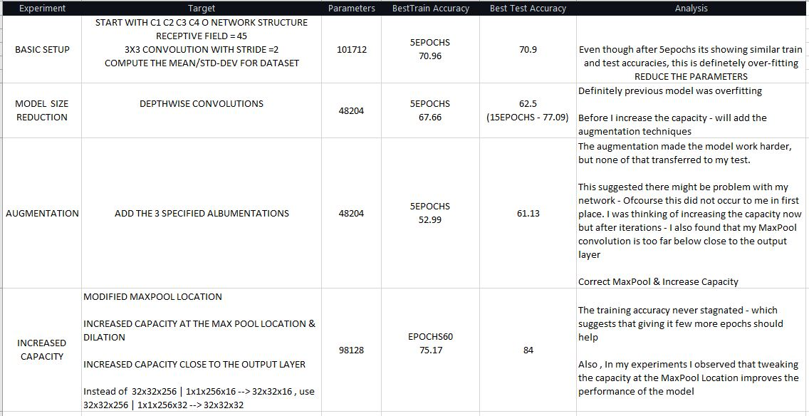

Name: Raghunadh Puranam

Email: raghunadpuranam@gmail.com

ASSIGNMENT TYPE = EARLY (<100K PARAMETERS)





**PLOTS**


```
EPOCH: 55
Loss=1.1722346544265747 Batch_id=390 Accuracy=74.69: 100%|██████████| 391/391 [00:24<00:00, 16.18it/s]
  0%|          | 0/391 [00:00<?, ?it/s]
Test set: Average loss: 4825.5538, Accuracy: 8380/10000 (83.80%)

EPOCH: 56
Loss=1.0871965885162354 Batch_id=390 Accuracy=75.04: 100%|██████████| 391/391 [00:24<00:00, 16.20it/s]
  0%|          | 0/391 [00:00<?, ?it/s]
Test set: Average loss: 4910.9203, Accuracy: 8307/10000 (83.07%)

EPOCH: 57
Loss=1.2461153268814087 Batch_id=390 Accuracy=74.90: 100%|██████████| 391/391 [00:24<00:00, 16.23it/s]
  0%|          | 0/391 [00:00<?, ?it/s]
Test set: Average loss: 5732.6454, Accuracy: 8071/10000 (80.71%)

EPOCH: 58
Loss=1.1085286140441895 Batch_id=390 Accuracy=74.74: 100%|██████████| 391/391 [00:24<00:00, 16.26it/s]
  0%|          | 0/391 [00:00<?, ?it/s]
Test set: Average loss: 5169.5063, Accuracy: 8222/10000 (82.22%)

EPOCH: 59
Loss=1.0175461769104004 Batch_id=390 Accuracy=75.17: 100%|██████████| 391/391 [00:24<00:00, 16.18it/s]
Clipping input data to the valid range for imshow with RGB data ([0..1] for floats or [0..255] for integers).
Test set: Average loss: 5032.2388, Accuracy: 8237/10000 (82.37%)
```


