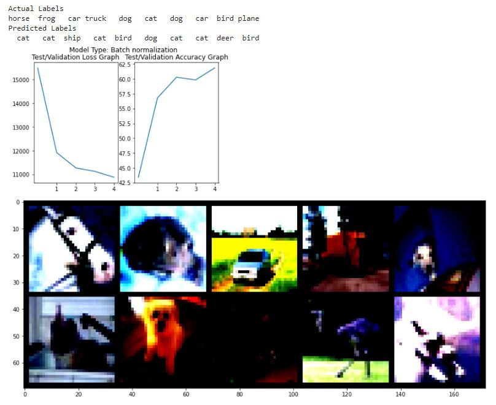

**CODE1 + DILATED CONVOLUTION IN BLOCK1**

**NOT SIGNIFICANT CHANGE**


```
EPOCH: 0
Loss=1.694533348083496 Batch_id=390 Accuracy=37.55: 100%|██████████| 391/391 [00:14<00:00, 26.57it/s]
  0%|          | 0/391 [00:00<?, ?it/s]
Test set: Average loss: 14633.9985, Accuracy: 4574/10000 (45.74%)

EPOCH: 1
Loss=1.5789366960525513 Batch_id=390 Accuracy=55.60: 100%|██████████| 391/391 [00:14<00:00, 26.89it/s]
  0%|          | 0/391 [00:00<?, ?it/s]
Test set: Average loss: 13469.4222, Accuracy: 5274/10000 (52.74%)

EPOCH: 2
Loss=1.5010379552841187 Batch_id=390 Accuracy=62.62: 100%|██████████| 391/391 [00:14<00:00, 27.16it/s]
  0%|          | 0/391 [00:00<?, ?it/s]
Test set: Average loss: 14542.4031, Accuracy: 5183/10000 (51.83%)

EPOCH: 3
Loss=1.262883186340332 Batch_id=390 Accuracy=67.03: 100%|██████████| 391/391 [00:14<00:00, 26.64it/s]
  0%|          | 0/391 [00:00<?, ?it/s]
Test set: Average loss: 10619.0621, Accuracy: 6281/10000 (62.81%)

EPOCH: 4
Loss=1.0580816268920898 Batch_id=390 Accuracy=70.42: 100%|██████████| 391/391 [00:14<00:00, 26.94it/s]
Clipping input data to the valid range for imshow with RGB data ([0..1] for floats or [0..255] for integers).
Test set: Average loss: 8266.6955, Accuracy: 7049/10000 (70.49%)
```

**CODE2:**

- **USE DILATED KERNELS FOR FIRST MAX POOLING** - Two conv with dilation 4 16-->32-->64
- **ADDED THE BATCHNORM/RELU MISSED (IN PREVIOUS STRIDE=2 CONVOLUTION FOR SIZE REDUCTION)**
- **PARAMERS : 123696**

EPOCH: 0
Loss=2.0536389350891113 Batch_id=390 Accuracy=37.96: 100%|██████████| 391/391 [00:17<00:00, 21.94it/s]
  0%|          | 0/391 [00:00<?, ?it/s]
Test set: Average loss: 15346.8089, Accuracy: 4783/10000 (47.83%)

EPOCH: 1
Loss=1.3264130353927612 Batch_id=390 Accuracy=57.47: 100%|██████████| 391/391 [00:17<00:00, 22.27it/s]
  0%|          | 0/391 [00:00<?, ?it/s]
Test set: Average loss: 12408.1523, Accuracy: 5481/10000 (54.81%)

EPOCH: 2
Loss=1.3251745700836182 Batch_id=390 Accuracy=64.82: 100%|██████████| 391/391 [00:17<00:00, 22.33it/s]
  0%|          | 0/391 [00:00<?, ?it/s]
Test set: Average loss: 10185.1827, Accuracy: 6388/10000 (63.88%)

EPOCH: 3
Loss=1.2029047012329102 Batch_id=390 Accuracy=69.48: 100%|██████████| 391/391 [00:17<00:00, 22.54it/s]
  0%|          | 0/391 [00:00<?, ?it/s]
Test set: Average loss: 10401.8313, Accuracy: 6503/10000 (65.03%)

EPOCH: 4
Loss=1.1415718793869019 Batch_id=390 Accuracy=72.38: 100%|██████████| 391/391 [00:17<00:00, 22.48it/s]
Clipping input data to the valid range for imshow with RGB data ([0..1] for floats or [0..255] for integers).
Test set: Average loss: 10785.2883, Accuracy: 6534/10000 (65.34%)

**CODE2:**

- **USE DILATED KERNELS FOR FIRST MAX POOLING**  - Instead 4 conv with dilation 2 , 16 -> 16 -> 16 -16
- **ADDED THE BATCHNORM/RELU MISSED (IN PREVIOUS STRIDE=2 CONVOLUTION FOR SIZE REDUCTION)**
- **PARAMERS : 108784****
- **CAUSING SIGNIFICANT DROP IN ACCURACY**

```
EPOCH: 0
Loss=1.5639240741729736 Batch_id=390 Accuracy=37.47: 100%|██████████| 391/391 [00:16<00:00, 23.47it/s]
  0%|          | 0/391 [00:00<?, ?it/s]
Test set: Average loss: 15679.5204, Accuracy: 4442/10000 (44.42%)

EPOCH: 1
Loss=1.6153011322021484 Batch_id=390 Accuracy=54.29: 100%|██████████| 391/391 [00:16<00:00, 23.34it/s]
  0%|          | 0/391 [00:00<?, ?it/s]
Test set: Average loss: 12214.6977, Accuracy: 5568/10000 (55.68%)

EPOCH: 2
Loss=1.3714450597763062 Batch_id=390 Accuracy=60.03: 100%|██████████| 391/391 [00:16<00:00, 23.88it/s]
  0%|          | 0/391 [00:00<?, ?it/s]
Test set: Average loss: 13563.9698, Accuracy: 5441/10000 (54.41%)

EPOCH: 3
Loss=1.2130606174468994 Batch_id=390 Accuracy=63.64: 100%|██████████| 391/391 [00:16<00:00, 23.48it/s]
  0%|          | 0/391 [00:00<?, ?it/s]
Test set: Average loss: 11428.0195, Accuracy: 5993/10000 (59.93%)

EPOCH: 4
Loss=1.2580900192260742 Batch_id=390 Accuracy=66.10: 100%|██████████| 391/391 [00:16<00:00, 23.78it/s]
Clipping input data to the valid range for imshow with RGB data ([0..1] for floats or [0..255] for integers).
Test set: Average loss: 10936.2583, Accuracy: 6226/10000 (62.26%)
```

**CODE2:**

- **REMOVE DILATED KERNELS and back to conv with stride 2**
- **ADDED ANOTHER LAYER IN BLOCK1 (CAPACITY INCREASE)**
- **PARAMS: 176784**
- **NO SIGNIFICANT IMPROVEMENT AT THE COST OF ACCURACY**


```
EPOCH: 0
Loss=1.9889304637908936 Batch_id=390 Accuracy=35.74: 100%|██████████| 391/391 [00:20<00:00, 18.88it/s]
  0%|          | 0/391 [00:00<?, ?it/s]
Test set: Average loss: 14427.1519, Accuracy: 4716/10000 (47.16%)

EPOCH: 1
Loss=1.5354633331298828 Batch_id=390 Accuracy=55.40: 100%|██████████| 391/391 [00:20<00:00, 18.86it/s]
  0%|          | 0/391 [00:00<?, ?it/s]
Test set: Average loss: 14950.4168, Accuracy: 4962/10000 (49.62%)

EPOCH: 2
Loss=1.4183714389801025 Batch_id=390 Accuracy=63.18: 100%|██████████| 391/391 [00:20<00:00, 19.25it/s]
  0%|          | 0/391 [00:00<?, ?it/s]
Test set: Average loss: 11388.4205, Accuracy: 5884/10000 (58.84%)

EPOCH: 3
Loss=1.3508070707321167 Batch_id=390 Accuracy=67.24: 100%|██████████| 391/391 [00:20<00:00, 19.22it/s]
  0%|          | 0/391 [00:00<?, ?it/s]
Test set: Average loss: 13992.9222, Accuracy: 5545/10000 (55.45%)

EPOCH: 4
Loss=1.316104769706726 Batch_id=390 Accuracy=70.20: 100%|██████████| 391/391 [00:20<00:00, 19.07it/s]
Clipping input data to the valid range for imshow with RGB data ([0..1] for floats or [0..255] for integers).
Test set: Average loss: 8922.4164, Accuracy: 6882/10000 (68.82%)
```

**CODE2:**

- **REMOVE DILATED KERNELS and back to conv with stride 2**
- **REMOVED ANOTHER LAYER IN BLOCK1 (CAPACITY INCREASE)**
- **PARAMS: 101776**
- **NO SIGNIFICANT IMPROVEMENT AT THE COST OF ACCURACY**

```
EPOCH: 0
Loss=1.68643057346344 Batch_id=390 Accuracy=37.93: 100%|██████████| 391/391 [00:14<00:00, 27.04it/s]
  0%|          | 0/391 [00:00<?, ?it/s]
Test set: Average loss: 15884.3150, Accuracy: 4187/10000 (41.87%)

EPOCH: 1
Loss=1.6173348426818848 Batch_id=390 Accuracy=56.02: 100%|██████████| 391/391 [00:14<00:00, 27.07it/s]
  0%|          | 0/391 [00:00<?, ?it/s]
Test set: Average loss: 14528.4633, Accuracy: 5030/10000 (50.30%)

EPOCH: 2
Loss=1.3920960426330566 Batch_id=390 Accuracy=63.01: 100%|██████████| 391/391 [00:14<00:00, 26.65it/s]
  0%|          | 0/391 [00:00<?, ?it/s]
Test set: Average loss: 10980.6530, Accuracy: 6096/10000 (60.96%)

EPOCH: 3
Loss=1.1446318626403809 Batch_id=390 Accuracy=67.10: 100%|██████████| 391/391 [00:14<00:00, 27.53it/s]
  0%|          | 0/391 [00:00<?, ?it/s]
Test set: Average loss: 9478.8324, Accuracy: 6657/10000 (66.57%)

EPOCH: 4
Loss=1.251739501953125 Batch_id=390 Accuracy=69.49: 100%|██████████| 391/391 [00:14<00:00, 27.45it/s]
Clipping input data to the valid range for imshow with RGB data ([0..1] for floats or [0..255] for integers).
Test set: Average loss: 9588.0115, Accuracy: 6558/10000 (65.58%)
```

**CODE2:**

- **REMOVE DILATED KERNELS and back to conv with stride 2**
- **REMOVED ANOTHER LAYER IN BLOCK1 (CAPACITY INCREASE)**
- **PARAMS: 83920****
- **ADDED + DEPTHWISE SEPARABLE CONVOLUTION IN BLOCK2 - 32x3x3x64 (18432) --> 576**

```
EPOCH: 0
Loss=1.6525218486785889 Batch_id=390 Accuracy=35.03: 100%|██████████| 391/391 [00:14<00:00, 27.13it/s]
  0%|          | 0/391 [00:00<?, ?it/s]
Test set: Average loss: 16049.5222, Accuracy: 3934/10000 (39.34%)

EPOCH: 1
Loss=1.2775638103485107 Batch_id=390 Accuracy=53.94: 100%|██████████| 391/391 [00:14<00:00, 27.60it/s]
  0%|          | 0/391 [00:00<?, ?it/s]
Test set: Average loss: 13455.5998, Accuracy: 5209/10000 (52.09%)

EPOCH: 2
Loss=1.3305399417877197 Batch_id=390 Accuracy=60.74: 100%|██████████| 391/391 [00:14<00:00, 27.65it/s]
  0%|          | 0/391 [00:00<?, ?it/s]
Test set: Average loss: 11024.7035, Accuracy: 5938/10000 (59.38%)

EPOCH: 3
Loss=1.2227153778076172 Batch_id=390 Accuracy=65.37: 100%|██████████| 391/391 [00:14<00:00, 27.47it/s]
  0%|          | 0/391 [00:00<?, ?it/s]
Test set: Average loss: 10073.4979, Accuracy: 6430/10000 (64.30%)

EPOCH: 4
Loss=1.2658741474151611 Batch_id=390 Accuracy=68.40: 100%|██████████| 391/391 [00:14<00:00, 27.64it/s]
Clipping input data to the valid range for imshow with RGB data ([0..1] for floats or [0..255] for integers).
Test set: Average loss: 9488.6356, Accuracy: 6594/10000 (65.94%)
```

**CODE2:**

- **REMOVE DILATED KERNELS and back to conv with stride 2**
- **REMOVED ANOTHER LAYER IN BLOCK1 (CAPACITY INCREASE)**
- **ADDED + DEPTHWISE SEPARABLE CONVOLUTION IN BLOCK2 - 32x3x3x64 (18432) --> 576**
- **PARAMS: 66064****
- **SINCE THERE WAS NO SIGNIFICANT DROP IN ACCURACY - CONVERTED ONE MORE LAYER TO  DEPTHWISE SEPARABLE**

```
EPOCH: 0
Loss=1.8156251907348633 Batch_id=390 Accuracy=36.54: 100%|██████████| 391/391 [00:14<00:00, 27.75it/s]
  0%|          | 0/391 [00:00<?, ?it/s]
Test set: Average loss: 15486.9941, Accuracy: 4342/10000 (43.42%)

EPOCH: 1
Loss=1.5019524097442627 Batch_id=390 Accuracy=53.22: 100%|██████████| 391/391 [00:14<00:00, 27.74it/s]
  0%|          | 0/391 [00:00<?, ?it/s]
Test set: Average loss: 11918.1585, Accuracy: 5680/10000 (56.80%)

EPOCH: 2
Loss=1.2700153589248657 Batch_id=390 Accuracy=60.14: 100%|██████████| 391/391 [00:13<00:00, 28.12it/s]
  0%|          | 0/391 [00:00<?, ?it/s]
Test set: Average loss: 11276.2534, Accuracy: 6029/10000 (60.29%)

EPOCH: 3
Loss=1.3184654712677002 Batch_id=390 Accuracy=65.03: 100%|██████████| 391/391 [00:13<00:00, 28.08it/s]
  0%|          | 0/391 [00:00<?, ?it/s]
Test set: Average loss: 11127.4128, Accuracy: 5984/10000 (59.84%)

EPOCH: 4
Loss=1.078700065612793 Batch_id=390 Accuracy=68.34: 100%|██████████| 391/391 [00:13<00:00, 28.28it/s]
Clipping input data to the valid range for imshow with RGB data ([0..1] for floats or [0..255] for integers).
Test set: Average loss: 10881.4826, Accuracy: 6186/10000 (61.86%)
```



**SAME ABOVE FOR 15EPOCHS ACCURACY:**

```
EPOCH: 0
Loss=1.7720634937286377 Batch_id=390 Accuracy=36.81: 100%|██████████| 391/391 [00:14<00:00, 27.71it/s]
  0%|          | 0/391 [00:00<?, ?it/s]
Test set: Average loss: 15343.8349, Accuracy: 4273/10000 (42.73%)

EPOCH: 1
Loss=1.5309386253356934 Batch_id=390 Accuracy=52.85: 100%|██████████| 391/391 [00:14<00:00, 27.48it/s]
  0%|          | 0/391 [00:00<?, ?it/s]
Test set: Average loss: 11710.1181, Accuracy: 5741/10000 (57.41%)

EPOCH: 2
Loss=1.2201322317123413 Batch_id=390 Accuracy=59.13: 100%|██████████| 391/391 [00:14<00:00, 27.49it/s]
  0%|          | 0/391 [00:00<?, ?it/s]
Test set: Average loss: 11736.5403, Accuracy: 5806/10000 (58.06%)

EPOCH: 3
Loss=1.4257233142852783 Batch_id=390 Accuracy=64.22: 100%|██████████| 391/391 [00:14<00:00, 27.09it/s]
  0%|          | 0/391 [00:00<?, ?it/s]
Test set: Average loss: 10558.8357, Accuracy: 6276/10000 (62.76%)

EPOCH: 4
Loss=1.1187652349472046 Batch_id=390 Accuracy=67.25: 100%|██████████| 391/391 [00:14<00:00, 27.48it/s]
  0%|          | 0/391 [00:00<?, ?it/s]
Test set: Average loss: 8970.0444, Accuracy: 6813/10000 (68.13%)

EPOCH: 5
Loss=1.1033564805984497 Batch_id=390 Accuracy=69.54: 100%|██████████| 391/391 [00:14<00:00, 27.07it/s]
  0%|          | 0/391 [00:00<?, ?it/s]
Test set: Average loss: 9780.1700, Accuracy: 6504/10000 (65.04%)

EPOCH: 6
Loss=1.2252488136291504 Batch_id=390 Accuracy=71.41: 100%|██████████| 391/391 [00:14<00:00, 27.40it/s]
  0%|          | 0/391 [00:00<?, ?it/s]
Test set: Average loss: 8655.8700, Accuracy: 6986/10000 (69.86%)

EPOCH: 7
Loss=1.0473928451538086 Batch_id=390 Accuracy=72.75: 100%|██████████| 391/391 [00:14<00:00, 27.11it/s]
  0%|          | 0/391 [00:00<?, ?it/s]
Test set: Average loss: 7999.6070, Accuracy: 7232/10000 (72.32%)

EPOCH: 8
Loss=1.1909980773925781 Batch_id=390 Accuracy=74.08: 100%|██████████| 391/391 [00:14<00:00, 27.10it/s]
  0%|          | 0/391 [00:00<?, ?it/s]
Test set: Average loss: 7570.4930, Accuracy: 7394/10000 (73.94%)

EPOCH: 9
Loss=0.9707867503166199 Batch_id=390 Accuracy=75.21: 100%|██████████| 391/391 [00:14<00:00, 26.85it/s]
  0%|          | 0/391 [00:00<?, ?it/s]
Test set: Average loss: 7382.3575, Accuracy: 7444/10000 (74.44%)

EPOCH: 10
Loss=1.0901284217834473 Batch_id=390 Accuracy=76.02: 100%|██████████| 391/391 [00:14<00:00, 27.33it/s]
  0%|          | 0/391 [00:00<?, ?it/s]
Test set: Average loss: 7703.2521, Accuracy: 7339/10000 (73.39%)

EPOCH: 11
Loss=0.8154867887496948 Batch_id=390 Accuracy=76.87: 100%|██████████| 391/391 [00:14<00:00, 27.36it/s]
  0%|          | 0/391 [00:00<?, ?it/s]
Test set: Average loss: 8119.7765, Accuracy: 7201/10000 (72.01%)

EPOCH: 12
Loss=0.8171105980873108 Batch_id=390 Accuracy=77.05: 100%|██████████| 391/391 [00:14<00:00, 27.05it/s]
  0%|          | 0/391 [00:00<?, ?it/s]
Test set: Average loss: 7053.8315, Accuracy: 7565/10000 (75.65%)

EPOCH: 13
Loss=0.9245587587356567 Batch_id=390 Accuracy=77.92: 100%|██████████| 391/391 [00:14<00:00, 26.74it/s]
  0%|          | 0/391 [00:00<?, ?it/s]
Test set: Average loss: 6997.6225, Accuracy: 7566/10000 (75.66%)

EPOCH: 14
Loss=0.8913822174072266 Batch_id=390 Accuracy=78.40: 100%|██████████| 391/391 [00:14<00:00, 27.33it/s]
Clipping input data to the valid range for imshow with RGB data ([0..1] for floats or [0..255] for integers).
Test set: Average loss: 7272.6426, Accuracy: 7610/10000 (76.10%)
```

**CODE2:**

- **REMOVE DILATED KERNELS and back to conv with stride 2**

- **REMOVED ANOTHER LAYER IN BLOCK1 (CAPACITY INCREASE)**

- **ADDED + DEPTHWISE SEPARABLE CONVOLUTION IN BLOCK2 - 32x3x3x64 (18432) --> 576**

- **ADDED + DEPTHWISE SEPARABLE CONVOLUTION IN BLOCK3**

- ***SINCE THERE WAS NO SIGNIFICANT DROP IN ACCURACY - CONVERTED ONE MORE LAYER TO  DEPTHWISE conv**

- **PARAMS: 48208****

  ```
  EPOCH: 0
  Loss=1.7044098377227783 Batch_id=390 Accuracy=34.10: 100%|██████████| 391/391 [00:14<00:00, 27.44it/s]
    0%|          | 0/391 [00:00<?, ?it/s]
  Test set: Average loss: 14075.3611, Accuracy: 4692/10000 (46.92%)
  
  EPOCH: 1
  Loss=1.3853843212127686 Batch_id=390 Accuracy=52.69: 100%|██████████| 391/391 [00:14<00:00, 27.75it/s]
    0%|          | 0/391 [00:00<?, ?it/s]
  Test set: Average loss: 12377.8733, Accuracy: 5560/10000 (55.60%)
  
  EPOCH: 2
  Loss=1.2151840925216675 Batch_id=390 Accuracy=60.39: 100%|██████████| 391/391 [00:14<00:00, 27.75it/s]
    0%|          | 0/391 [00:00<?, ?it/s]
  Test set: Average loss: 12875.3105, Accuracy: 5389/10000 (53.89%)
  
  EPOCH: 3
  Loss=1.1957571506500244 Batch_id=390 Accuracy=64.46: 100%|██████████| 391/391 [00:13<00:00, 27.95it/s]
    0%|          | 0/391 [00:00<?, ?it/s]
  Test set: Average loss: 9942.4109, Accuracy: 6511/10000 (65.11%)
  
  EPOCH: 4
  Loss=1.0937849283218384 Batch_id=390 Accuracy=67.66: 100%|██████████| 391/391 [00:14<00:00, 27.59it/s]
    0%|          | 0/391 [00:00<?, ?it/s]
  Test set: Average loss: 10436.1303, Accuracy: 6250/10000 (62.50%)
  
  EPOCH: 5
  Loss=1.2009977102279663 Batch_id=390 Accuracy=69.69: 100%|██████████| 391/391 [00:13<00:00, 28.02it/s]
    0%|          | 0/391 [00:00<?, ?it/s]
  Test set: Average loss: 8628.7695, Accuracy: 6960/10000 (69.60%)
  
  EPOCH: 6
  Loss=1.0122265815734863 Batch_id=390 Accuracy=71.64: 100%|██████████| 391/391 [00:13<00:00, 28.15it/s]
    0%|          | 0/391 [00:00<?, ?it/s]
  Test set: Average loss: 8937.2119, Accuracy: 6847/10000 (68.47%)
  
  EPOCH: 7
  Loss=0.8464715480804443 Batch_id=390 Accuracy=72.77: 100%|██████████| 391/391 [00:13<00:00, 28.39it/s]
    0%|          | 0/391 [00:00<?, ?it/s]
  Test set: Average loss: 8060.3078, Accuracy: 7136/10000 (71.36%)
  
  EPOCH: 8
  Loss=0.9521738290786743 Batch_id=390 Accuracy=73.73: 100%|██████████| 391/391 [00:14<00:00, 27.71it/s]
    0%|          | 0/391 [00:00<?, ?it/s]
  Test set: Average loss: 8131.0396, Accuracy: 7133/10000 (71.33%)
  
  EPOCH: 9
  Loss=1.2117085456848145 Batch_id=390 Accuracy=75.03: 100%|██████████| 391/391 [00:13<00:00, 28.27it/s]
    0%|          | 0/391 [00:00<?, ?it/s]
  Test set: Average loss: 8967.1349, Accuracy: 6969/10000 (69.69%)
  
  EPOCH: 10
  Loss=0.8976686000823975 Batch_id=390 Accuracy=75.51: 100%|██████████| 391/391 [00:14<00:00, 27.66it/s]
    0%|          | 0/391 [00:00<?, ?it/s]
  Test set: Average loss: 8255.7692, Accuracy: 7151/10000 (71.51%)
  
  EPOCH: 11
  Loss=1.0756300687789917 Batch_id=390 Accuracy=76.38: 100%|██████████| 391/391 [00:13<00:00, 28.24it/s]
    0%|          | 0/391 [00:00<?, ?it/s]
  Test set: Average loss: 7142.2827, Accuracy: 7544/10000 (75.44%)
  
  EPOCH: 12
  Loss=0.9631180763244629 Batch_id=390 Accuracy=76.72: 100%|██████████| 391/391 [00:14<00:00, 27.85it/s]
    0%|          | 0/391 [00:00<?, ?it/s]
  Test set: Average loss: 7929.9420, Accuracy: 7296/10000 (72.96%)
  
  EPOCH: 13
  Loss=0.8655526638031006 Batch_id=390 Accuracy=77.46: 100%|██████████| 391/391 [00:13<00:00, 27.93it/s]
    0%|          | 0/391 [00:00<?, ?it/s]
  Test set: Average loss: 7439.9167, Accuracy: 7422/10000 (74.22%)
  
  EPOCH: 14
  Loss=0.958840548992157 Batch_id=390 Accuracy=78.15: 100%|██████████| 391/391 [00:14<00:00, 27.91it/s]
  Clipping input data to the valid range for imshow with RGB data ([0..1] for floats or [0..255] for integers).
  Test set: Average loss: 6709.9478, Accuracy: 7709/10000 (77.09%)
  ```


**CODE3: CODE2 + HorizontalFlip**

```
EPOCH: 0
Loss=1.7715656757354736 Batch_id=390 Accuracy=34.00: 100%|██████████| 391/391 [00:11<00:00, 34.16it/s]
  0%|          | 0/391 [00:00<?, ?it/s]
Test set: Average loss: 14714.2259, Accuracy: 4256/10000 (42.56%)

EPOCH: 1
Loss=1.3141751289367676 Batch_id=390 Accuracy=52.75: 100%|██████████| 391/391 [00:11<00:00, 34.43it/s]
  0%|          | 0/391 [00:00<?, ?it/s]
Test set: Average loss: 13362.3437, Accuracy: 5184/10000 (51.84%)

EPOCH: 2
Loss=1.3317465782165527 Batch_id=390 Accuracy=60.92: 100%|██████████| 391/391 [00:11<00:00, 34.38it/s]
  0%|          | 0/391 [00:00<?, ?it/s]
Test set: Average loss: 11160.1122, Accuracy: 5982/10000 (59.82%)

EPOCH: 3
Loss=1.2117998600006104 Batch_id=390 Accuracy=65.01: 100%|██████████| 391/391 [00:11<00:00, 34.45it/s]
  0%|          | 0/391 [00:00<?, ?it/s]
Test set: Average loss: 9968.8299, Accuracy: 6476/10000 (64.76%)

EPOCH: 4
Loss=1.0680665969848633 Batch_id=390 Accuracy=67.85: 100%|██████████| 391/391 [00:11<00:00, 34.55it/s]
Clipping input data to the valid range for imshow with RGB data ([0..1] for floats or [0..255] for integers).
Test set: Average loss: 11023.9267, Accuracy: 6143/10000 (61.43%)
```

**CODE3: CODE2 + HorizontalFlip + SHIFTSCALEROTATE**

```
EPOCH: 0
Loss=1.9729593992233276 Batch_id=390 Accuracy=31.42: 100%|██████████| 391/391 [00:12<00:00, 31.93it/s]
  0%|          | 0/391 [00:00<?, ?it/s]
Test set: Average loss: 16694.9821, Accuracy: 3838/10000 (38.38%)

EPOCH: 1
Loss=1.471387505531311 Batch_id=390 Accuracy=46.11: 100%|██████████| 391/391 [00:12<00:00, 31.87it/s]
  0%|          | 0/391 [00:00<?, ?it/s]
Test set: Average loss: 13683.0374, Accuracy: 5016/10000 (50.16%)

EPOCH: 2
Loss=1.4747304916381836 Batch_id=390 Accuracy=52.34: 100%|██████████| 391/391 [00:12<00:00, 31.99it/s]
  0%|          | 0/391 [00:00<?, ?it/s]
Test set: Average loss: 12139.1165, Accuracy: 5633/10000 (56.33%)

EPOCH: 3
Loss=1.364179015159607 Batch_id=390 Accuracy=55.97: 100%|██████████| 391/391 [00:12<00:00, 31.84it/s]
  0%|          | 0/391 [00:00<?, ?it/s]
Test set: Average loss: 11248.4056, Accuracy: 5940/10000 (59.40%)

EPOCH: 4
Loss=1.2738995552062988 Batch_id=390 Accuracy=58.82: 100%|██████████| 391/391 [00:12<00:00, 32.22it/s]
Clipping input data to the valid range for imshow with RGB data ([0..1] for floats or [0..255] for integers).
Test set: Average loss: 10612.1758, Accuracy: 6212/10000 (62.12%)
```

**CODE3: CODE2 + HorizontalFlip + SHIFTSCALEROTATE + CoarseDropOut**

```
EPOCH: 0
Loss=1.9606297016143799 Batch_id=390 Accuracy=28.60: 100%|██████████| 391/391 [00:12<00:00, 30.38it/s]
  0%|          | 0/391 [00:00<?, ?it/s]
Test set: Average loss: 16115.0213, Accuracy: 3781/10000 (37.81%)

EPOCH: 1
Loss=1.6069353818893433 Batch_id=390 Accuracy=41.65: 100%|██████████| 391/391 [00:12<00:00, 30.49it/s]
  0%|          | 0/391 [00:00<?, ?it/s]
Test set: Average loss: 14846.8339, Accuracy: 4625/10000 (46.25%)

EPOCH: 2
Loss=1.7133972644805908 Batch_id=390 Accuracy=47.35: 100%|██████████| 391/391 [00:12<00:00, 30.25it/s]
  0%|          | 0/391 [00:00<?, ?it/s]
Test set: Average loss: 13027.5271, Accuracy: 5288/10000 (52.88%)

EPOCH: 3
Loss=1.5631033182144165 Batch_id=390 Accuracy=50.38: 100%|██████████| 391/391 [00:12<00:00, 30.51it/s]
  0%|          | 0/391 [00:00<?, ?it/s]
Test set: Average loss: 13416.2558, Accuracy: 5120/10000 (51.20%)

EPOCH: 4
Loss=1.3600883483886719 Batch_id=390 Accuracy=52.99: 100%|██████████| 391/391 [00:13<00:00, 30.06it/s]
Clipping input data to the valid range for imshow with RGB data ([0..1] for floats or [0..255] for integers).
Test set: Average loss: 10735.6219, Accuracy: 6113/10000 (61.13%)
```


```
EPOCH: 0
Loss=1.935713291168213 Batch_id=390 Accuracy=29.15: 100%|██████████| 391/391 [00:12<00:00, 30.93it/s]
  0%|          | 0/391 [00:00<?, ?it/s]
Test set: Average loss: 16380.5047, Accuracy: 3787/10000 (37.87%)

EPOCH: 1
Loss=1.6020843982696533 Batch_id=390 Accuracy=41.62: 100%|██████████| 391/391 [00:12<00:00, 30.99it/s]
  0%|          | 0/391 [00:00<?, ?it/s]
Test set: Average loss: 15458.8305, Accuracy: 4508/10000 (45.08%)

EPOCH: 2
Loss=1.6487157344818115 Batch_id=390 Accuracy=47.14: 100%|██████████| 391/391 [00:12<00:00, 30.85it/s]
  0%|          | 0/391 [00:00<?, ?it/s]
Test set: Average loss: 12251.1928, Accuracy: 5528/10000 (55.28%)

EPOCH: 3
Loss=1.5201427936553955 Batch_id=390 Accuracy=50.65: 100%|██████████| 391/391 [00:12<00:00, 30.49it/s]
  0%|          | 0/391 [00:00<?, ?it/s]
Test set: Average loss: 11281.9672, Accuracy: 5946/10000 (59.46%)

EPOCH: 4
Loss=1.3335217237472534 Batch_id=390 Accuracy=53.61: 100%|██████████| 391/391 [00:12<00:00, 30.80it/s]
  0%|          | 0/391 [00:00<?, ?it/s]
Test set: Average loss: 10518.4506, Accuracy: 6301/10000 (63.01%)

EPOCH: 5
Loss=1.5681886672973633 Batch_id=390 Accuracy=55.62: 100%|██████████| 391/391 [00:12<00:00, 30.69it/s]
  0%|          | 0/391 [00:00<?, ?it/s]
Test set: Average loss: 10192.9344, Accuracy: 6354/10000 (63.54%)

EPOCH: 6
Loss=1.4309477806091309 Batch_id=390 Accuracy=57.07: 100%|██████████| 391/391 [00:12<00:00, 30.65it/s]
  0%|          | 0/391 [00:00<?, ?it/s]
Test set: Average loss: 11482.1898, Accuracy: 5968/10000 (59.68%)

EPOCH: 7
Loss=1.2791210412979126 Batch_id=390 Accuracy=58.24: 100%|██████████| 391/391 [00:12<00:00, 30.44it/s]
  0%|          | 0/391 [00:00<?, ?it/s]
Test set: Average loss: 10117.4051, Accuracy: 6339/10000 (63.39%)

EPOCH: 8
Loss=1.3471488952636719 Batch_id=390 Accuracy=59.54: 100%|██████████| 391/391 [00:12<00:00, 30.76it/s]
  0%|          | 0/391 [00:00<?, ?it/s]
Test set: Average loss: 9432.5789, Accuracy: 6611/10000 (66.11%)

EPOCH: 9
Loss=1.5500216484069824 Batch_id=390 Accuracy=59.90: 100%|██████████| 391/391 [00:12<00:00, 30.65it/s]
  0%|          | 0/391 [00:00<?, ?it/s]
Test set: Average loss: 10524.1708, Accuracy: 6364/10000 (63.64%)

EPOCH: 10
Loss=1.201769232749939 Batch_id=390 Accuracy=60.78: 100%|██████████| 391/391 [00:12<00:00, 30.48it/s]
  0%|          | 0/391 [00:00<?, ?it/s]
Test set: Average loss: 9227.7553, Accuracy: 6767/10000 (67.67%)

EPOCH: 11
Loss=1.390712857246399 Batch_id=390 Accuracy=61.51: 100%|██████████| 391/391 [00:12<00:00, 30.32it/s]
  0%|          | 0/391 [00:00<?, ?it/s]
Test set: Average loss: 9126.0095, Accuracy: 6861/10000 (68.61%)

EPOCH: 12
Loss=1.3898060321807861 Batch_id=390 Accuracy=62.66: 100%|██████████| 391/391 [00:12<00:00, 30.50it/s]
  0%|          | 0/391 [00:00<?, ?it/s]
Test set: Average loss: 9158.7475, Accuracy: 6695/10000 (66.95%)

EPOCH: 13
Loss=1.2217390537261963 Batch_id=390 Accuracy=63.14: 100%|██████████| 391/391 [00:12<00:00, 30.69it/s]
  0%|          | 0/391 [00:00<?, ?it/s]
Test set: Average loss: 9006.9249, Accuracy: 6815/10000 (68.15%)

EPOCH: 14
Loss=1.5532739162445068 Batch_id=390 Accuracy=63.38: 100%|██████████| 391/391 [00:12<00:00, 30.31it/s]
  0%|          | 0/391 [00:00<?, ?it/s]
Test set: Average loss: 8749.2334, Accuracy: 6961/10000 (69.61%)

EPOCH: 15
Loss=1.3387117385864258 Batch_id=390 Accuracy=63.96: 100%|██████████| 391/391 [00:12<00:00, 30.08it/s]
  0%|          | 0/391 [00:00<?, ?it/s]
Test set: Average loss: 8107.1402, Accuracy: 7160/10000 (71.60%)

EPOCH: 16
Loss=1.2464380264282227 Batch_id=390 Accuracy=64.39: 100%|██████████| 391/391 [00:12<00:00, 30.26it/s]
  0%|          | 0/391 [00:00<?, ?it/s]
Test set: Average loss: 8349.9433, Accuracy: 7072/10000 (70.72%)

EPOCH: 17
Loss=1.1630803346633911 Batch_id=390 Accuracy=64.64: 100%|██████████| 391/391 [00:12<00:00, 30.40it/s]
  0%|          | 0/391 [00:00<?, ?it/s]
Test set: Average loss: 8602.8509, Accuracy: 6933/10000 (69.33%)

EPOCH: 18
Loss=1.3005856275558472 Batch_id=390 Accuracy=64.95: 100%|██████████| 391/391 [00:12<00:00, 30.57it/s]
  0%|          | 0/391 [00:00<?, ?it/s]
Test set: Average loss: 7863.6523, Accuracy: 7281/10000 (72.81%)

EPOCH: 19
Loss=1.062679648399353 Batch_id=390 Accuracy=65.35: 100%|██████████| 391/391 [00:12<00:00, 30.49it/s]
Clipping input data to the valid range for imshow with RGB data ([0..1] for floats or [0..255] for integers).
Test set: Average loss: 7754.5279, Accuracy: 7267/10000 (72.67%)
```

**PARAMS 68K**

```
EPOCH: 0
Loss=2.815739154815674 Batch_id=390 Accuracy=23.57: 100%|██████████| 391/391 [00:18<00:00, 20.83it/s]
  0%|          | 0/391 [00:00<?, ?it/s]
Test set: Average loss: 18081.6593, Accuracy: 3106/10000 (31.06%)

EPOCH: 1
Loss=2.725229501724243 Batch_id=390 Accuracy=38.96: 100%|██████████| 391/391 [00:18<00:00, 20.91it/s]
  0%|          | 0/391 [00:00<?, ?it/s]
Test set: Average loss: 16802.9353, Accuracy: 3815/10000 (38.15%)

EPOCH: 2
Loss=2.60213041305542 Batch_id=390 Accuracy=45.58: 100%|██████████| 391/391 [00:18<00:00, 20.70it/s]
  0%|          | 0/391 [00:00<?, ?it/s]
Test set: Average loss: 14193.6847, Accuracy: 4851/10000 (48.51%)

EPOCH: 3
Loss=2.263958215713501 Batch_id=390 Accuracy=49.16: 100%|██████████| 391/391 [00:18<00:00, 20.58it/s]
  0%|          | 0/391 [00:00<?, ?it/s]
Test set: Average loss: 11992.5039, Accuracy: 5736/10000 (57.36%)

EPOCH: 4
Loss=2.4595656394958496 Batch_id=390 Accuracy=52.47: 100%|██████████| 391/391 [00:19<00:00, 20.48it/s]
  0%|          | 0/391 [00:00<?, ?it/s]
Test set: Average loss: 11418.2670, Accuracy: 5900/10000 (59.00%)

EPOCH: 5
Loss=2.320519208908081 Batch_id=390 Accuracy=54.87: 100%|██████████| 391/391 [00:19<00:00, 20.55it/s]
  0%|          | 0/391 [00:00<?, ?it/s]
Test set: Average loss: 12544.7570, Accuracy: 5606/10000 (56.06%)

EPOCH: 6
Loss=2.4679007530212402 Batch_id=390 Accuracy=56.81: 100%|██████████| 391/391 [00:18<00:00, 20.64it/s]
  0%|          | 0/391 [00:00<?, ?it/s]
Test set: Average loss: 9895.8875, Accuracy: 6406/10000 (64.06%)

EPOCH: 7
Loss=2.2315890789031982 Batch_id=390 Accuracy=58.31: 100%|██████████| 391/391 [00:19<00:00, 20.45it/s]
  0%|          | 0/391 [00:00<?, ?it/s]
Test set: Average loss: 9798.0827, Accuracy: 6558/10000 (65.58%)

EPOCH: 8
Loss=2.1055009365081787 Batch_id=390 Accuracy=59.46: 100%|██████████| 391/391 [00:19<00:00, 20.52it/s]
  0%|          | 0/391 [00:00<?, ?it/s]
Test set: Average loss: 9602.0299, Accuracy: 6573/10000 (65.73%)

EPOCH: 9
Loss=2.1268815994262695 Batch_id=390 Accuracy=60.45: 100%|██████████| 391/391 [00:19<00:00, 20.36it/s]
  0%|          | 0/391 [00:00<?, ?it/s]
Test set: Average loss: 9079.3631, Accuracy: 6813/10000 (68.13%)

EPOCH: 10
Loss=2.006777763366699 Batch_id=390 Accuracy=61.11: 100%|██████████| 391/391 [00:19<00:00, 20.40it/s]
  0%|          | 0/391 [00:00<?, ?it/s]
Test set: Average loss: 9329.9978, Accuracy: 6696/10000 (66.96%)

EPOCH: 11
Loss=2.0605273246765137 Batch_id=390 Accuracy=62.12: 100%|██████████| 391/391 [00:19<00:00, 20.41it/s]
  0%|          | 0/391 [00:00<?, ?it/s]
Test set: Average loss: 9248.8178, Accuracy: 6800/10000 (68.00%)

EPOCH: 12
Loss=2.078551769256592 Batch_id=390 Accuracy=62.54: 100%|██████████| 391/391 [00:19<00:00, 20.38it/s]
  0%|          | 0/391 [00:00<?, ?it/s]
Test set: Average loss: 8943.9991, Accuracy: 6891/10000 (68.91%)

EPOCH: 13
Loss=1.8310017585754395 Batch_id=390 Accuracy=63.42: 100%|██████████| 391/391 [00:19<00:00, 20.38it/s]
  0%|          | 0/391 [00:00<?, ?it/s]
Test set: Average loss: 9191.3739, Accuracy: 6748/10000 (67.48%)

EPOCH: 14
Loss=2.0058116912841797 Batch_id=390 Accuracy=63.95: 100%|██████████| 391/391 [00:19<00:00, 20.38it/s]
  0%|          | 0/391 [00:00<?, ?it/s]
Test set: Average loss: 8796.9188, Accuracy: 6900/10000 (69.00%)

EPOCH: 15
Loss=1.803152322769165 Batch_id=390 Accuracy=64.27: 100%|██████████| 391/391 [00:19<00:00, 20.42it/s]
  0%|          | 0/391 [00:00<?, ?it/s]
Test set: Average loss: 9577.5979, Accuracy: 6586/10000 (65.86%)

EPOCH: 16
Loss=1.7984747886657715 Batch_id=390 Accuracy=64.74: 100%|██████████| 391/391 [00:19<00:00, 20.31it/s]
  0%|          | 0/391 [00:00<?, ?it/s]
Test set: Average loss: 8552.3785, Accuracy: 7026/10000 (70.26%)

EPOCH: 17
Loss=2.04011869430542 Batch_id=390 Accuracy=65.18: 100%|██████████| 391/391 [00:19<00:00, 20.31it/s]
  0%|          | 0/391 [00:00<?, ?it/s]
Test set: Average loss: 7954.3209, Accuracy: 7266/10000 (72.66%)

EPOCH: 18
Loss=1.944050669670105 Batch_id=390 Accuracy=65.58: 100%|██████████| 391/391 [00:19<00:00, 20.45it/s]
  0%|          | 0/391 [00:00<?, ?it/s]
Test set: Average loss: 7953.4696, Accuracy: 7238/10000 (72.38%)

EPOCH: 19
Loss=1.9126142263412476 Batch_id=390 Accuracy=65.60: 100%|██████████| 391/391 [00:19<00:00, 20.32it/s]
Clipping input data to the valid range for imshow with RGB data ([0..1] for floats or [0..255] for integers).
Test set: Average loss: 7597.0924, Accuracy: 7375/10000 (73.75%)
```

**PARAMS 68K + EPOCHS40 - 78.19**

1. **First reduction in training accuracy at EPOCH34 69.03 --> 68.99**
2. **Best train accuracy 69.32**

**PARAMS 68K + EPOCHS40 + LR-0.02**

- EPOCH27 - 76.7
- EPOCH - 78.39
- CONSISTENT 77% 

```
EPOCH: 0
Loss=2.6462931632995605 Batch_id=390 Accuracy=29.33: 100%|██████████| 391/391 [00:18<00:00, 20.59it/s]
  0%|          | 0/391 [00:00<?, ?it/s]
Test set: Average loss: 17088.1189, Accuracy: 3687/10000 (36.87%)

EPOCH: 1
Loss=2.470327854156494 Batch_id=390 Accuracy=42.88: 100%|██████████| 391/391 [00:19<00:00, 20.56it/s]
  0%|          | 0/391 [00:00<?, ?it/s]
Test set: Average loss: 13666.9427, Accuracy: 5023/10000 (50.23%)

EPOCH: 2
Loss=2.54417085647583 Batch_id=390 Accuracy=47.44: 100%|██████████| 391/391 [00:19<00:00, 20.42it/s]
  0%|          | 0/391 [00:00<?, ?it/s]
Test set: Average loss: 12923.4273, Accuracy: 5352/10000 (53.52%)

EPOCH: 3
Loss=2.2123422622680664 Batch_id=390 Accuracy=51.37: 100%|██████████| 391/391 [00:19<00:00, 20.46it/s]
  0%|          | 0/391 [00:00<?, ?it/s]
Test set: Average loss: 12078.0831, Accuracy: 5672/10000 (56.72%)

EPOCH: 4
Loss=2.398242473602295 Batch_id=390 Accuracy=53.57: 100%|██████████| 391/391 [00:18<00:00, 20.61it/s]
  0%|          | 0/391 [00:00<?, ?it/s]
Test set: Average loss: 11728.4950, Accuracy: 5848/10000 (58.48%)

EPOCH: 5
Loss=2.3542070388793945 Batch_id=390 Accuracy=55.89: 100%|██████████| 391/391 [00:18<00:00, 20.61it/s]
  0%|          | 0/391 [00:00<?, ?it/s]
Test set: Average loss: 10782.1535, Accuracy: 6145/10000 (61.45%)

EPOCH: 6
Loss=2.284332036972046 Batch_id=390 Accuracy=57.33: 100%|██████████| 391/391 [00:19<00:00, 20.54it/s]
  0%|          | 0/391 [00:00<?, ?it/s]
Test set: Average loss: 10106.6019, Accuracy: 6349/10000 (63.49%)

EPOCH: 7
Loss=2.244706630706787 Batch_id=390 Accuracy=58.53: 100%|██████████| 391/391 [00:18<00:00, 20.66it/s]
  0%|          | 0/391 [00:00<?, ?it/s]
Test set: Average loss: 10253.2624, Accuracy: 6450/10000 (64.50%)

EPOCH: 8
Loss=1.9346697330474854 Batch_id=390 Accuracy=59.89: 100%|██████████| 391/391 [00:18<00:00, 20.65it/s]
  0%|          | 0/391 [00:00<?, ?it/s]
Test set: Average loss: 9676.6374, Accuracy: 6523/10000 (65.23%)

EPOCH: 9
Loss=2.0603182315826416 Batch_id=390 Accuracy=60.54: 100%|██████████| 391/391 [00:19<00:00, 20.54it/s]
  0%|          | 0/391 [00:00<?, ?it/s]
Test set: Average loss: 9758.5204, Accuracy: 6554/10000 (65.54%)

EPOCH: 10
Loss=1.8906219005584717 Batch_id=390 Accuracy=61.21: 100%|██████████| 391/391 [00:19<00:00, 20.54it/s]
  0%|          | 0/391 [00:00<?, ?it/s]
Test set: Average loss: 9929.5679, Accuracy: 6474/10000 (64.74%)

EPOCH: 11
Loss=2.102024555206299 Batch_id=390 Accuracy=61.96: 100%|██████████| 391/391 [00:19<00:00, 20.54it/s]
  0%|          | 0/391 [00:00<?, ?it/s]
Test set: Average loss: 8721.8931, Accuracy: 6953/10000 (69.53%)

EPOCH: 12
Loss=1.9331080913543701 Batch_id=390 Accuracy=62.40: 100%|██████████| 391/391 [00:18<00:00, 20.59it/s]
  0%|          | 0/391 [00:00<?, ?it/s]
Test set: Average loss: 8319.6301, Accuracy: 7121/10000 (71.21%)

EPOCH: 13
Loss=1.6593859195709229 Batch_id=390 Accuracy=63.34: 100%|██████████| 391/391 [00:19<00:00, 20.49it/s]
  0%|          | 0/391 [00:00<?, ?it/s]
Test set: Average loss: 9130.5298, Accuracy: 6783/10000 (67.83%)

EPOCH: 14
Loss=1.8519723415374756 Batch_id=390 Accuracy=63.53: 100%|██████████| 391/391 [00:19<00:00, 20.55it/s]
  0%|          | 0/391 [00:00<?, ?it/s]
Test set: Average loss: 8804.9193, Accuracy: 6869/10000 (68.69%)

EPOCH: 15
Loss=1.7658947706222534 Batch_id=390 Accuracy=64.34: 100%|██████████| 391/391 [00:19<00:00, 20.47it/s]
  0%|          | 0/391 [00:00<?, ?it/s]
Test set: Average loss: 8158.6912, Accuracy: 7144/10000 (71.44%)

EPOCH: 16
Loss=1.7028441429138184 Batch_id=390 Accuracy=64.36: 100%|██████████| 391/391 [00:19<00:00, 20.51it/s]
  0%|          | 0/391 [00:00<?, ?it/s]
Test set: Average loss: 9309.1165, Accuracy: 6737/10000 (67.37%)

EPOCH: 17
Loss=2.0075974464416504 Batch_id=390 Accuracy=65.07: 100%|██████████| 391/391 [00:19<00:00, 20.48it/s]
  0%|          | 0/391 [00:00<?, ?it/s]
Test set: Average loss: 7854.4651, Accuracy: 7288/10000 (72.88%)

EPOCH: 18
Loss=1.8474372625350952 Batch_id=390 Accuracy=65.08: 100%|██████████| 391/391 [00:19<00:00, 20.47it/s]
  0%|          | 0/391 [00:00<?, ?it/s]
Test set: Average loss: 8104.9939, Accuracy: 7152/10000 (71.52%)

EPOCH: 19
Loss=1.805827260017395 Batch_id=390 Accuracy=65.15: 100%|██████████| 391/391 [00:19<00:00, 20.41it/s]
  0%|          | 0/391 [00:00<?, ?it/s]
Test set: Average loss: 7336.6519, Accuracy: 7489/10000 (74.89%)

EPOCH: 20
Loss=1.738080620765686 Batch_id=390 Accuracy=65.94: 100%|██████████| 391/391 [00:19<00:00, 20.49it/s]
  0%|          | 0/391 [00:00<?, ?it/s]
Test set: Average loss: 8914.5558, Accuracy: 6854/10000 (68.54%)

EPOCH: 21
Loss=1.574070930480957 Batch_id=390 Accuracy=66.24: 100%|██████████| 391/391 [00:19<00:00, 20.45it/s]
  0%|          | 0/391 [00:00<?, ?it/s]
Test set: Average loss: 7888.5684, Accuracy: 7276/10000 (72.76%)

EPOCH: 22
Loss=1.410532832145691 Batch_id=390 Accuracy=66.22: 100%|██████████| 391/391 [00:19<00:00, 20.34it/s]
  0%|          | 0/391 [00:00<?, ?it/s]
Test set: Average loss: 7705.9704, Accuracy: 7385/10000 (73.85%)

EPOCH: 23
Loss=1.625279426574707 Batch_id=390 Accuracy=66.30: 100%|██████████| 391/391 [00:19<00:00, 20.32it/s]
  0%|          | 0/391 [00:00<?, ?it/s]
Test set: Average loss: 7552.0857, Accuracy: 7421/10000 (74.21%)

EPOCH: 24
Loss=1.7041336297988892 Batch_id=390 Accuracy=66.68: 100%|██████████| 391/391 [00:19<00:00, 20.37it/s]
  0%|          | 0/391 [00:00<?, ?it/s]
Test set: Average loss: 7846.8813, Accuracy: 7301/10000 (73.01%)

EPOCH: 25
Loss=1.6924505233764648 Batch_id=390 Accuracy=66.85: 100%|██████████| 391/391 [00:19<00:00, 20.30it/s]
  0%|          | 0/391 [00:00<?, ?it/s]
Test set: Average loss: 7007.3127, Accuracy: 7528/10000 (75.28%)

EPOCH: 26
Loss=1.4382476806640625 Batch_id=390 Accuracy=67.25: 100%|██████████| 391/391 [00:19<00:00, 20.22it/s]
  0%|          | 0/391 [00:00<?, ?it/s]
Test set: Average loss: 6990.9085, Accuracy: 7580/10000 (75.80%)

EPOCH: 27
Loss=1.6176791191101074 Batch_id=390 Accuracy=67.34: 100%|██████████| 391/391 [00:19<00:00, 20.18it/s]
  0%|          | 0/391 [00:00<?, ?it/s]
Test set: Average loss: 6774.3049, Accuracy: 7670/10000 (76.70%)

EPOCH: 28
Loss=1.5634517669677734 Batch_id=390 Accuracy=67.53: 100%|██████████| 391/391 [00:19<00:00, 20.26it/s]
  0%|          | 0/391 [00:00<?, ?it/s]
Test set: Average loss: 7351.9363, Accuracy: 7410/10000 (74.10%)

EPOCH: 29
Loss=1.5874871015548706 Batch_id=390 Accuracy=67.62: 100%|██████████| 391/391 [00:19<00:00, 20.31it/s]
  0%|          | 0/391 [00:00<?, ?it/s]
Test set: Average loss: 7578.5559, Accuracy: 7360/10000 (73.60%)

EPOCH: 30
Loss=1.5091099739074707 Batch_id=390 Accuracy=67.84: 100%|██████████| 391/391 [00:19<00:00, 20.33it/s]
  0%|          | 0/391 [00:00<?, ?it/s]
Test set: Average loss: 6794.6449, Accuracy: 7655/10000 (76.55%)

EPOCH: 31
Loss=1.3379769325256348 Batch_id=390 Accuracy=67.66: 100%|██████████| 391/391 [00:19<00:00, 20.45it/s]
  0%|          | 0/391 [00:00<?, ?it/s]
Test set: Average loss: 6843.8954, Accuracy: 7624/10000 (76.24%)

EPOCH: 32
Loss=1.3879159688949585 Batch_id=390 Accuracy=68.05: 100%|██████████| 391/391 [00:19<00:00, 20.43it/s]
  0%|          | 0/391 [00:00<?, ?it/s]
Test set: Average loss: 6635.2266, Accuracy: 7741/10000 (77.41%)

EPOCH: 33
Loss=1.4179182052612305 Batch_id=390 Accuracy=68.22: 100%|██████████| 391/391 [00:19<00:00, 20.39it/s]
  0%|          | 0/391 [00:00<?, ?it/s]
Test set: Average loss: 6374.3569, Accuracy: 7839/10000 (78.39%)

EPOCH: 34
Loss=1.4861950874328613 Batch_id=390 Accuracy=68.34: 100%|██████████| 391/391 [00:19<00:00, 20.37it/s]
  0%|          | 0/391 [00:00<?, ?it/s]
Test set: Average loss: 6709.2943, Accuracy: 7626/10000 (76.26%)

EPOCH: 35
Loss=1.540407657623291 Batch_id=390 Accuracy=68.45: 100%|██████████| 391/391 [00:19<00:00, 20.47it/s]
  0%|          | 0/391 [00:00<?, ?it/s]
Test set: Average loss: 7153.7420, Accuracy: 7549/10000 (75.49%)

EPOCH: 36
Loss=1.5425503253936768 Batch_id=390 Accuracy=68.58: 100%|██████████| 391/391 [00:19<00:00, 20.43it/s]
  0%|          | 0/391 [00:00<?, ?it/s]
Test set: Average loss: 6681.0864, Accuracy: 7651/10000 (76.51%)

EPOCH: 37
Loss=1.7079482078552246 Batch_id=390 Accuracy=68.80: 100%|██████████| 391/391 [00:19<00:00, 20.39it/s]
  0%|          | 0/391 [00:00<?, ?it/s]
Test set: Average loss: 6716.3894, Accuracy: 7682/10000 (76.82%)

EPOCH: 38
Loss=1.3568955659866333 Batch_id=390 Accuracy=68.77: 100%|██████████| 391/391 [00:19<00:00, 20.30it/s]
  0%|          | 0/391 [00:00<?, ?it/s]
Test set: Average loss: 6977.4163, Accuracy: 7605/10000 (76.05%)

EPOCH: 39
Loss=1.4993627071380615 Batch_id=390 Accuracy=69.14: 100%|██████████| 391/391 [00:19<00:00, 20.36it/s]
Clipping input data to the valid range for imshow with RGB data ([0..1] for floats or [0..255] for integers).
Test set: Average loss: 7433.0373, Accuracy: 7391/10000 (73.91%)
```


GROUP NORM +ABOVE + 20 EPOCHS


```
EPOCH: 0
Loss=2.9920406341552734 Batch_id=390 Accuracy=18.72: 100%|██████████| 391/391 [00:19<00:00, 19.99it/s]
  0%|          | 0/391 [00:00<?, ?it/s]
Test set: Average loss: 19266.3028, Accuracy: 2774/10000 (27.74%)

EPOCH: 1
Loss=2.864713191986084 Batch_id=390 Accuracy=29.12: 100%|██████████| 391/391 [00:19<00:00, 20.13it/s]
  0%|          | 0/391 [00:00<?, ?it/s]
Test set: Average loss: 17876.7518, Accuracy: 3501/10000 (35.01%)

EPOCH: 2
Loss=2.735243797302246 Batch_id=390 Accuracy=33.58: 100%|██████████| 391/391 [00:19<00:00, 20.41it/s]
  0%|          | 0/391 [00:00<?, ?it/s]
Test set: Average loss: 16188.5593, Accuracy: 3995/10000 (39.95%)

EPOCH: 3
Loss=2.5367889404296875 Batch_id=390 Accuracy=36.80: 100%|██████████| 391/391 [00:19<00:00, 20.51it/s]
  0%|          | 0/391 [00:00<?, ?it/s]
Test set: Average loss: 15333.6415, Accuracy: 4383/10000 (43.83%)

EPOCH: 4
Loss=2.687159299850464 Batch_id=390 Accuracy=39.32: 100%|██████████| 391/391 [00:19<00:00, 20.55it/s]
  0%|          | 0/391 [00:00<?, ?it/s]
Test set: Average loss: 14641.0787, Accuracy: 4610/10000 (46.10%)

EPOCH: 5
Loss=2.4746580123901367 Batch_id=390 Accuracy=40.99: 100%|██████████| 391/391 [00:19<00:00, 20.37it/s]
  0%|          | 0/391 [00:00<?, ?it/s]
Test set: Average loss: 14399.3479, Accuracy: 4747/10000 (47.47%)

EPOCH: 6
Loss=2.5507678985595703 Batch_id=390 Accuracy=42.56: 100%|██████████| 391/391 [00:19<00:00, 20.46it/s]
  0%|          | 0/391 [00:00<?, ?it/s]
Test set: Average loss: 13988.8629, Accuracy: 4738/10000 (47.38%)

EPOCH: 7
Loss=2.5563113689422607 Batch_id=390 Accuracy=44.23: 100%|██████████| 391/391 [00:19<00:00, 20.36it/s]
  0%|          | 0/391 [00:00<?, ?it/s]
Test set: Average loss: 13033.4128, Accuracy: 5316/10000 (53.16%)

EPOCH: 8
Loss=2.1877493858337402 Batch_id=390 Accuracy=45.40: 100%|██████████| 391/391 [00:18<00:00, 20.58it/s]
  0%|          | 0/391 [00:00<?, ?it/s]
Test set: Average loss: 12720.7704, Accuracy: 5397/10000 (53.97%)

EPOCH: 9
Loss=2.329986572265625 Batch_id=390 Accuracy=46.28: 100%|██████████| 391/391 [00:19<00:00, 20.42it/s]
  0%|          | 0/391 [00:00<?, ?it/s]
Test set: Average loss: 12500.9881, Accuracy: 5449/10000 (54.49%)

EPOCH: 10
Loss=2.278846263885498 Batch_id=390 Accuracy=46.33: 100%|██████████| 391/391 [00:19<00:00, 20.47it/s]
  0%|          | 0/391 [00:00<?, ?it/s]
Test set: Average loss: 13849.8177, Accuracy: 5028/10000 (50.28%)

EPOCH: 11
Loss=2.325252056121826 Batch_id=390 Accuracy=47.30: 100%|██████████| 391/391 [00:19<00:00, 20.32it/s]
  0%|          | 0/391 [00:00<?, ?it/s]
Test set: Average loss: 12189.7419, Accuracy: 5499/10000 (54.99%)

EPOCH: 12
Loss=2.0619442462921143 Batch_id=390 Accuracy=47.67: 100%|██████████| 391/391 [00:19<00:00, 20.29it/s]
  0%|          | 0/391 [00:00<?, ?it/s]
Test set: Average loss: 11884.5173, Accuracy: 5711/10000 (57.11%)

EPOCH: 13
Loss=1.947688341140747 Batch_id=390 Accuracy=49.17: 100%|██████████| 391/391 [00:19<00:00, 20.25it/s]
  0%|          | 0/391 [00:00<?, ?it/s]
Test set: Average loss: 11696.6354, Accuracy: 5816/10000 (58.16%)

EPOCH: 14
Loss=2.2391164302825928 Batch_id=390 Accuracy=49.88: 100%|██████████| 391/391 [00:19<00:00, 20.34it/s]
  0%|          | 0/391 [00:00<?, ?it/s]
Test set: Average loss: 12363.1528, Accuracy: 5525/10000 (55.25%)

EPOCH: 15
Loss=2.1515960693359375 Batch_id=390 Accuracy=50.07: 100%|██████████| 391/391 [00:19<00:00, 20.43it/s]
  0%|          | 0/391 [00:00<?, ?it/s]
Test set: Average loss: 13291.8065, Accuracy: 5331/10000 (53.31%)

EPOCH: 16
Loss=1.9029138088226318 Batch_id=390 Accuracy=50.54: 100%|██████████| 391/391 [00:19<00:00, 20.25it/s]
  0%|          | 0/391 [00:00<?, ?it/s]
Test set: Average loss: 11259.0134, Accuracy: 5868/10000 (58.68%)

EPOCH: 17
Loss=2.1498360633850098 Batch_id=390 Accuracy=50.91: 100%|██████████| 391/391 [00:19<00:00, 20.37it/s]
  0%|          | 0/391 [00:00<?, ?it/s]
Test set: Average loss: 12126.0779, Accuracy: 5586/10000 (55.86%)

EPOCH: 18
Loss=2.0132498741149902 Batch_id=390 Accuracy=51.20: 100%|██████████| 391/391 [00:19<00:00, 20.39it/s]
  0%|          | 0/391 [00:00<?, ?it/s]
Test set: Average loss: 11083.1840, Accuracy: 6080/10000 (60.80%)

EPOCH: 19
Loss=1.9806320667266846 Batch_id=390 Accuracy=52.09: 100%|██████████| 391/391 [00:19<00:00, 20.26it/s]
Clipping input data to the valid range for imshow with RGB data ([0..1] for floats or [0..255] for integers).
Test set: Average loss: 10817.1885, Accuracy: 6073/10000 (60.73%)
```

**MODIFIED MAXPOOL LOCATION**


```
EPOCH: 0
Loss=2.5912203788757324 Batch_id=390 Accuracy=30.19: 100%|██████████| 391/391 [00:18<00:00, 21.20it/s]
  0%|          | 0/391 [00:00<?, ?it/s]
Test set: Average loss: 15425.3542, Accuracy: 4318/10000 (43.18%)

EPOCH: 1
Loss=2.412022590637207 Batch_id=390 Accuracy=43.22: 100%|██████████| 391/391 [00:18<00:00, 21.15it/s]
  0%|          | 0/391 [00:00<?, ?it/s]
Test set: Average loss: 13506.5090, Accuracy: 5135/10000 (51.35%)

EPOCH: 2
Loss=2.529297351837158 Batch_id=390 Accuracy=48.00: 100%|██████████| 391/391 [00:18<00:00, 21.02it/s]
  0%|          | 0/391 [00:00<?, ?it/s]
Test set: Average loss: 12317.7368, Accuracy: 5536/10000 (55.36%)

EPOCH: 3
Loss=2.2405781745910645 Batch_id=390 Accuracy=51.43: 100%|██████████| 391/391 [00:18<00:00, 21.15it/s]
  0%|          | 0/391 [00:00<?, ?it/s]
Test set: Average loss: 11007.7127, Accuracy: 6057/10000 (60.57%)

EPOCH: 4
Loss=2.4822463989257812 Batch_id=390 Accuracy=54.10: 100%|██████████| 391/391 [00:18<00:00, 21.20it/s]
  0%|          | 0/391 [00:00<?, ?it/s]
Test set: Average loss: 11463.9127, Accuracy: 5884/10000 (58.84%)

EPOCH: 5
Loss=2.264274835586548 Batch_id=390 Accuracy=56.14: 100%|██████████| 391/391 [00:18<00:00, 21.11it/s]
  0%|          | 0/391 [00:00<?, ?it/s]
Test set: Average loss: 10114.0897, Accuracy: 6425/10000 (64.25%)

EPOCH: 6
Loss=2.3383569717407227 Batch_id=390 Accuracy=57.59: 100%|██████████| 391/391 [00:18<00:00, 21.00it/s]
  0%|          | 0/391 [00:00<?, ?it/s]
Test set: Average loss: 10231.5648, Accuracy: 6314/10000 (63.14%)

EPOCH: 7
Loss=2.186518430709839 Batch_id=390 Accuracy=58.93: 100%|██████████| 391/391 [00:18<00:00, 21.11it/s]
  0%|          | 0/391 [00:00<?, ?it/s]
Test set: Average loss: 8976.0742, Accuracy: 6875/10000 (68.75%)

EPOCH: 8
Loss=1.9268096685409546 Batch_id=390 Accuracy=59.69: 100%|██████████| 391/391 [00:18<00:00, 21.02it/s]
  0%|          | 0/391 [00:00<?, ?it/s]
Test set: Average loss: 8996.2434, Accuracy: 6851/10000 (68.51%)

EPOCH: 9
Loss=1.9891579151153564 Batch_id=390 Accuracy=60.92: 100%|██████████| 391/391 [00:18<00:00, 21.00it/s]
  0%|          | 0/391 [00:00<?, ?it/s]
Test set: Average loss: 8327.8835, Accuracy: 7165/10000 (71.65%)

EPOCH: 10
Loss=1.9201343059539795 Batch_id=390 Accuracy=62.06: 100%|██████████| 391/391 [00:18<00:00, 20.86it/s]
  0%|          | 0/391 [00:00<?, ?it/s]
Test set: Average loss: 11206.2210, Accuracy: 6145/10000 (61.45%)

EPOCH: 11
Loss=2.0844976902008057 Batch_id=390 Accuracy=62.28: 100%|██████████| 391/391 [00:18<00:00, 21.05it/s]
  0%|          | 0/391 [00:00<?, ?it/s]
Test set: Average loss: 8967.2401, Accuracy: 6879/10000 (68.79%)

EPOCH: 12
Loss=1.8321292400360107 Batch_id=390 Accuracy=63.00: 100%|██████████| 391/391 [00:18<00:00, 21.08it/s]
  0%|          | 0/391 [00:00<?, ?it/s]
Test set: Average loss: 8457.5578, Accuracy: 7078/10000 (70.78%)

EPOCH: 13
Loss=1.7311360836029053 Batch_id=390 Accuracy=63.49: 100%|██████████| 391/391 [00:18<00:00, 21.05it/s]
  0%|          | 0/391 [00:00<?, ?it/s]
Test set: Average loss: 8121.3213, Accuracy: 7238/10000 (72.38%)

EPOCH: 14
Loss=1.7409324645996094 Batch_id=390 Accuracy=64.03: 100%|██████████| 391/391 [00:18<00:00, 20.99it/s]
  0%|          | 0/391 [00:00<?, ?it/s]
Test set: Average loss: 8214.7105, Accuracy: 7146/10000 (71.46%)

EPOCH: 15
Loss=1.705353021621704 Batch_id=390 Accuracy=64.36: 100%|██████████| 391/391 [00:18<00:00, 21.10it/s]
  0%|          | 0/391 [00:00<?, ?it/s]
Test set: Average loss: 7741.7875, Accuracy: 7317/10000 (73.17%)

EPOCH: 16
Loss=1.7111183404922485 Batch_id=390 Accuracy=64.59: 100%|██████████| 391/391 [00:18<00:00, 21.09it/s]
  0%|          | 0/391 [00:00<?, ?it/s]
Test set: Average loss: 7703.8698, Accuracy: 7343/10000 (73.43%)

EPOCH: 17
Loss=2.0584499835968018 Batch_id=390 Accuracy=64.79: 100%|██████████| 391/391 [00:18<00:00, 21.09it/s]
  0%|          | 0/391 [00:00<?, ?it/s]
Test set: Average loss: 8341.1369, Accuracy: 7100/10000 (71.00%)

EPOCH: 18
Loss=1.813486099243164 Batch_id=390 Accuracy=65.10: 100%|██████████| 391/391 [00:18<00:00, 21.18it/s]
  0%|          | 0/391 [00:00<?, ?it/s]
Test set: Average loss: 7286.7681, Accuracy: 7544/10000 (75.44%)

EPOCH: 19
Loss=1.7535648345947266 Batch_id=390 Accuracy=65.45: 100%|██████████| 391/391 [00:18<00:00, 21.16it/s]
  0%|          | 0/391 [00:00<?, ?it/s]
Test set: Average loss: 7802.2437, Accuracy: 7299/10000 (72.99%)

EPOCH: 20
Loss=1.7081859111785889 Batch_id=390 Accuracy=66.02: 100%|██████████| 391/391 [00:18<00:00, 21.02it/s]
  0%|          | 0/391 [00:00<?, ?it/s]
Test set: Average loss: 9146.9211, Accuracy: 6765/10000 (67.65%)

EPOCH: 21
Loss=1.5816911458969116 Batch_id=390 Accuracy=65.96: 100%|██████████| 391/391 [00:18<00:00, 21.13it/s]
  0%|          | 0/391 [00:00<?, ?it/s]
Test set: Average loss: 7138.0210, Accuracy: 7623/10000 (76.23%)

EPOCH: 22
Loss=1.5048141479492188 Batch_id=390 Accuracy=66.47: 100%|██████████| 391/391 [00:18<00:00, 21.05it/s]
  0%|          | 0/391 [00:00<?, ?it/s]
Test set: Average loss: 7439.2340, Accuracy: 7439/10000 (74.39%)

EPOCH: 23
Loss=1.6109315156936646 Batch_id=390 Accuracy=66.68: 100%|██████████| 391/391 [00:18<00:00, 21.23it/s]
  0%|          | 0/391 [00:00<?, ?it/s]
Test set: Average loss: 7772.5866, Accuracy: 7356/10000 (73.56%)

EPOCH: 24
Loss=1.5696568489074707 Batch_id=390 Accuracy=66.75: 100%|██████████| 391/391 [00:18<00:00, 21.10it/s]
Clipping input data to the valid range for imshow with RGB data ([0..1] for floats or [0..255] for integers).
Test set: Average loss: 7254.7236, Accuracy: 7494/10000 (74.94%)
```

**MODIFIED MAX-POOL + DILATION**

PARAMS : 112K

```
EPOCH: 0
Loss=2.781404972076416 Batch_id=390 Accuracy=31.73: 100%|██████████| 391/391 [00:22<00:00, 17.42it/s]
  0%|          | 0/391 [00:00<?, ?it/s]
Test set: Average loss: 15567.1297, Accuracy: 4234/10000 (42.34%)

EPOCH: 1
Loss=2.614610195159912 Batch_id=390 Accuracy=46.41: 100%|██████████| 391/391 [00:22<00:00, 17.28it/s]
  0%|          | 0/391 [00:00<?, ?it/s]
Test set: Average loss: 13194.6996, Accuracy: 5314/10000 (53.14%)

EPOCH: 2
Loss=2.287686347961426 Batch_id=390 Accuracy=51.32: 100%|██████████| 391/391 [00:22<00:00, 17.56it/s]
  0%|          | 0/391 [00:00<?, ?it/s]
Test set: Average loss: 11112.3446, Accuracy: 6054/10000 (60.54%)

EPOCH: 3
Loss=2.409575939178467 Batch_id=390 Accuracy=55.76: 100%|██████████| 391/391 [00:22<00:00, 17.52it/s]
  0%|          | 0/391 [00:00<?, ?it/s]
Test set: Average loss: 10560.8506, Accuracy: 6320/10000 (63.20%)

EPOCH: 4
Loss=2.455794334411621 Batch_id=390 Accuracy=58.14: 100%|██████████| 391/391 [00:22<00:00, 17.49it/s]
  0%|          | 0/391 [00:00<?, ?it/s]
Test set: Average loss: 9576.0416, Accuracy: 6592/10000 (65.92%)

EPOCH: 5
Loss=2.1849074363708496 Batch_id=390 Accuracy=60.21: 100%|██████████| 391/391 [00:22<00:00, 17.40it/s]
  0%|          | 0/391 [00:00<?, ?it/s]
Test set: Average loss: 11792.5523, Accuracy: 5825/10000 (58.25%)

EPOCH: 6
Loss=2.1853466033935547 Batch_id=390 Accuracy=61.73: 100%|██████████| 391/391 [00:22<00:00, 17.45it/s]
  0%|          | 0/391 [00:00<?, ?it/s]
Test set: Average loss: 8744.7497, Accuracy: 6971/10000 (69.71%)

EPOCH: 7
Loss=2.0365476608276367 Batch_id=390 Accuracy=62.92: 100%|██████████| 391/391 [00:22<00:00, 17.45it/s]
  0%|          | 0/391 [00:00<?, ?it/s]
Test set: Average loss: 8686.2780, Accuracy: 7002/10000 (70.02%)

EPOCH: 8
Loss=2.0758168697357178 Batch_id=390 Accuracy=63.76: 100%|██████████| 391/391 [00:22<00:00, 17.47it/s]
  0%|          | 0/391 [00:00<?, ?it/s]
Test set: Average loss: 8707.6758, Accuracy: 6952/10000 (69.52%)

EPOCH: 9
Loss=1.8215947151184082 Batch_id=390 Accuracy=64.90: 100%|██████████| 391/391 [00:22<00:00, 17.40it/s]
  0%|          | 0/391 [00:00<?, ?it/s]
Test set: Average loss: 8792.6327, Accuracy: 7054/10000 (70.54%)

EPOCH: 10
Loss=1.9007025957107544 Batch_id=390 Accuracy=65.48: 100%|██████████| 391/391 [00:22<00:00, 17.50it/s]
  0%|          | 0/391 [00:00<?, ?it/s]
Test set: Average loss: 7642.7892, Accuracy: 7310/10000 (73.10%)

EPOCH: 11
Loss=2.0707101821899414 Batch_id=390 Accuracy=65.79: 100%|██████████| 391/391 [00:22<00:00, 17.38it/s]
  0%|          | 0/391 [00:00<?, ?it/s]
Test set: Average loss: 8049.4929, Accuracy: 7289/10000 (72.89%)

EPOCH: 12
Loss=1.9391754865646362 Batch_id=390 Accuracy=66.45: 100%|██████████| 391/391 [00:22<00:00, 17.43it/s]
  0%|          | 0/391 [00:00<?, ?it/s]
Test set: Average loss: 7174.7834, Accuracy: 7507/10000 (75.07%)

EPOCH: 13
Loss=1.6955294609069824 Batch_id=390 Accuracy=67.52: 100%|██████████| 391/391 [00:22<00:00, 17.45it/s]
  0%|          | 0/391 [00:00<?, ?it/s]
Test set: Average loss: 6819.5420, Accuracy: 7648/10000 (76.48%)

EPOCH: 14
Loss=1.9271059036254883 Batch_id=390 Accuracy=67.29: 100%|██████████| 391/391 [00:22<00:00, 17.36it/s]
  0%|          | 0/391 [00:00<?, ?it/s]
Test set: Average loss: 7738.1836, Accuracy: 7312/10000 (73.12%)

EPOCH: 15
Loss=1.7270163297653198 Batch_id=390 Accuracy=67.81: 100%|██████████| 391/391 [00:22<00:00, 17.46it/s]
  0%|          | 0/391 [00:00<?, ?it/s]
Test set: Average loss: 7813.4670, Accuracy: 7331/10000 (73.31%)

EPOCH: 16
Loss=1.837947130203247 Batch_id=390 Accuracy=68.04: 100%|██████████| 391/391 [00:22<00:00, 17.36it/s]
  0%|          | 0/391 [00:00<?, ?it/s]
Test set: Average loss: 6966.1765, Accuracy: 7577/10000 (75.77%)

EPOCH: 17
Loss=1.6649432182312012 Batch_id=390 Accuracy=68.20: 100%|██████████| 391/391 [00:22<00:00, 17.39it/s]
  0%|          | 0/391 [00:00<?, ?it/s]
Test set: Average loss: 6465.0581, Accuracy: 7775/10000 (77.75%)

EPOCH: 18
Loss=1.8607800006866455 Batch_id=390 Accuracy=68.65: 100%|██████████| 391/391 [00:22<00:00, 17.46it/s]
  0%|          | 0/391 [00:00<?, ?it/s]
Test set: Average loss: 6664.9799, Accuracy: 7699/10000 (76.99%)

EPOCH: 19
Loss=1.713327169418335 Batch_id=390 Accuracy=69.03: 100%|██████████| 391/391 [00:22<00:00, 17.39it/s]
  0%|          | 0/391 [00:00<?, ?it/s]
Test set: Average loss: 6943.8977, Accuracy: 7630/10000 (76.30%)

EPOCH: 20
Loss=1.7172601222991943 Batch_id=390 Accuracy=68.85: 100%|██████████| 391/391 [00:22<00:00, 17.45it/s]
  0%|          | 0/391 [00:00<?, ?it/s]
Test set: Average loss: 6084.8941, Accuracy: 7930/10000 (79.30%)

EPOCH: 21
Loss=1.600172996520996 Batch_id=390 Accuracy=69.42: 100%|██████████| 391/391 [00:22<00:00, 17.40it/s]
  0%|          | 0/391 [00:00<?, ?it/s]
Test set: Average loss: 7142.2758, Accuracy: 7557/10000 (75.57%)

EPOCH: 22
Loss=1.7200024127960205 Batch_id=390 Accuracy=69.92: 100%|██████████| 391/391 [00:22<00:00, 17.45it/s]
  0%|          | 0/391 [00:00<?, ?it/s]
Test set: Average loss: 6285.7064, Accuracy: 7827/10000 (78.27%)

EPOCH: 23
Loss=1.6928257942199707 Batch_id=390 Accuracy=69.65: 100%|██████████| 391/391 [00:22<00:00, 17.38it/s]
  0%|          | 0/391 [00:00<?, ?it/s]
Test set: Average loss: 6829.7889, Accuracy: 7696/10000 (76.96%)

EPOCH: 24
Loss=1.62193763256073 Batch_id=390 Accuracy=70.24: 100%|██████████| 391/391 [00:22<00:00, 17.37it/s]
Clipping input data to the valid range for imshow with RGB data ([0..1] for floats or [0..255] for integers).
Test set: Average loss: 6317.0153, Accuracy: 7841/10000 (78.41%)
```

