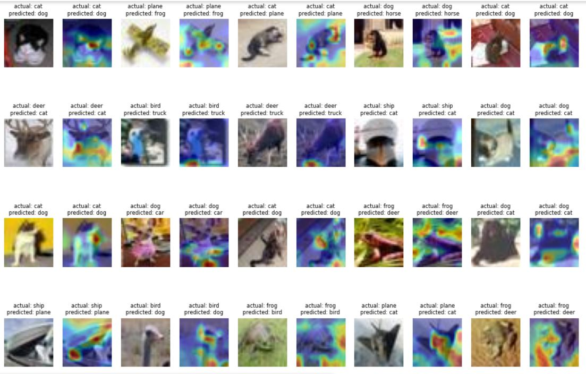
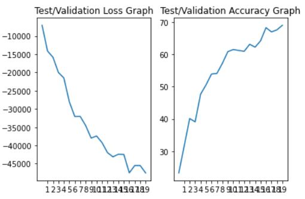
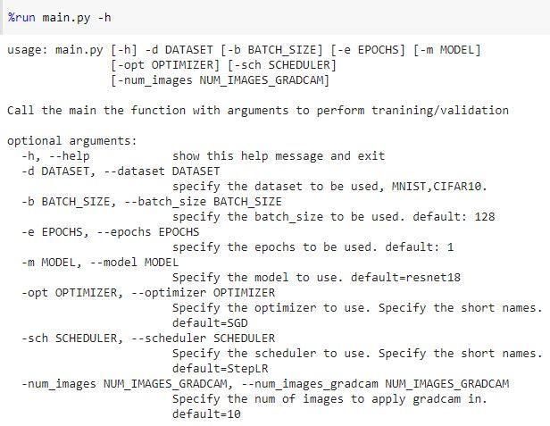

**MAIN REPO:**

https://github.com/raghunadh-eva/eva6/tree/master/master_repo

<u>**MIS-CLASSIFIED IMAGES  & gradcam output**</u>




**TEST/VALIDATION PLOTS:**



**TRAINING LOGS**

```
Epoch 0, lr 0.02
Loss=6.493502140045166 Batch_id=390 Accuracy=16.49: 100%|██████████| 391/391 [02:22<00:00,  2.75it/s]
  0%|          | 0/391 [00:00<?, ?it/s]
Test set: Average loss: -7059.6160, Accuracy: 2324/10000 (23.24%)

Epoch 1, lr 0.02
Loss=3.5925793647766113 Batch_id=390 Accuracy=27.13: 100%|██████████| 391/391 [02:24<00:00,  2.70it/s]
  0%|          | 0/391 [00:00<?, ?it/s]
Test set: Average loss: -14112.9298, Accuracy: 3166/10000 (31.66%)

Epoch 2, lr 0.02
Loss=2.948284149169922 Batch_id=390 Accuracy=33.24: 100%|██████████| 391/391 [02:24<00:00,  2.71it/s]
  0%|          | 0/391 [00:00<?, ?it/s]
Test set: Average loss: -15832.5601, Accuracy: 4013/10000 (40.13%)

Epoch 3, lr 0.02
Loss=2.5798251628875732 Batch_id=390 Accuracy=37.13: 100%|██████████| 391/391 [02:23<00:00,  2.72it/s]
  0%|          | 0/391 [00:00<?, ?it/s]
Test set: Average loss: -20006.4496, Accuracy: 3909/10000 (39.09%)

Epoch 4, lr 0.02
Loss=2.309041738510132 Batch_id=390 Accuracy=40.44: 100%|██████████| 391/391 [02:23<00:00,  2.72it/s]
  0%|          | 0/391 [00:00<?, ?it/s]
Test set: Average loss: -21510.9391, Accuracy: 4767/10000 (47.67%)

Epoch 5, lr 0.02
Loss=2.0857112407684326 Batch_id=390 Accuracy=44.08: 100%|██████████| 391/391 [02:23<00:00,  2.72it/s]
  0%|          | 0/391 [00:00<?, ?it/s]
Test set: Average loss: -28035.2995, Accuracy: 5057/10000 (50.57%)

Epoch 6, lr 0.02
Loss=1.7955379486083984 Batch_id=390 Accuracy=47.08: 100%|██████████| 391/391 [02:23<00:00,  2.73it/s]
Epoch     7: reducing learning rate of group 0 to 1.4000e-02.
  0%|          | 0/391 [00:00<?, ?it/s]
Test set: Average loss: -32078.9918, Accuracy: 5393/10000 (53.93%)

Epoch 7, lr 0.013999999999999999
Loss=1.8677756786346436 Batch_id=390 Accuracy=50.43: 100%|██████████| 391/391 [02:22<00:00,  2.74it/s]
  0%|          | 0/391 [00:00<?, ?it/s]
Test set: Average loss: -32053.3330, Accuracy: 5413/10000 (54.13%)

Epoch 8, lr 0.013999999999999999
Loss=2.1843209266662598 Batch_id=390 Accuracy=53.12: 100%|██████████| 391/391 [02:24<00:00,  2.71it/s]
  0%|          | 0/391 [00:00<?, ?it/s]
Test set: Average loss: -34566.8469, Accuracy: 5726/10000 (57.26%)

Epoch 9, lr 0.013999999999999999
Loss=1.8700530529022217 Batch_id=390 Accuracy=54.35: 100%|██████████| 391/391 [02:24<00:00,  2.71it/s]
  0%|          | 0/391 [00:00<?, ?it/s]
Test set: Average loss: -37987.5765, Accuracy: 6088/10000 (60.88%)

Epoch 10, lr 0.013999999999999999
Loss=2.048628330230713 Batch_id=390 Accuracy=55.83: 100%|██████████| 391/391 [02:23<00:00,  2.72it/s]
  0%|          | 0/391 [00:00<?, ?it/s]
Test set: Average loss: -37410.0735, Accuracy: 6154/10000 (61.54%)

Epoch 11, lr 0.013999999999999999
Loss=1.6341745853424072 Batch_id=390 Accuracy=56.87: 100%|██████████| 391/391 [02:23<00:00,  2.72it/s]
  0%|          | 0/391 [00:00<?, ?it/s]
Test set: Average loss: -39235.6081, Accuracy: 6125/10000 (61.25%)

Epoch 12, lr 0.013999999999999999
Loss=1.8169020414352417 Batch_id=390 Accuracy=57.68: 100%|██████████| 391/391 [02:23<00:00,  2.73it/s]
Epoch    13: reducing learning rate of group 0 to 9.8000e-03.
  0%|          | 0/391 [00:00<?, ?it/s]
Test set: Average loss: -41973.3827, Accuracy: 6099/10000 (60.99%)

Epoch 13, lr 0.009799999999999998
Loss=1.8838319778442383 Batch_id=390 Accuracy=60.51: 100%|██████████| 391/391 [02:23<00:00,  2.73it/s]
  0%|          | 0/391 [00:00<?, ?it/s]
Test set: Average loss: -43122.4803, Accuracy: 6316/10000 (63.16%)

Epoch 14, lr 0.009799999999999998
Loss=1.6362437009811401 Batch_id=390 Accuracy=60.85: 100%|██████████| 391/391 [02:22<00:00,  2.74it/s]
  0%|          | 0/391 [00:00<?, ?it/s]
Test set: Average loss: -42418.2361, Accuracy: 6228/10000 (62.28%)

Epoch 15, lr 0.009799999999999998
Loss=1.7381185293197632 Batch_id=390 Accuracy=61.55: 100%|██████████| 391/391 [02:24<00:00,  2.71it/s]
  0%|          | 0/391 [00:00<?, ?it/s]
Test set: Average loss: -42470.9836, Accuracy: 6423/10000 (64.23%)

Epoch 16, lr 0.009799999999999998
Loss=1.5552144050598145 Batch_id=390 Accuracy=62.05: 100%|██████████| 391/391 [02:24<00:00,  2.71it/s]
  0%|          | 0/391 [00:00<?, ?it/s]
Test set: Average loss: -47519.8326, Accuracy: 6832/10000 (68.32%)

Epoch 17, lr 0.009799999999999998
Loss=1.855047345161438 Batch_id=390 Accuracy=62.20: 100%|██████████| 391/391 [02:24<00:00,  2.71it/s]
  0%|          | 0/391 [00:00<?, ?it/s]
Test set: Average loss: -45507.8275, Accuracy: 6701/10000 (67.01%)

Epoch 18, lr 0.009799999999999998
Loss=1.441567301750183 Batch_id=390 Accuracy=62.97: 100%|██████████| 391/391 [02:23<00:00,  2.72it/s]
Epoch    19: reducing learning rate of group 0 to 6.8600e-03.
  0%|          | 0/391 [00:00<?, ?it/s]
Test set: Average loss: -45512.9371, Accuracy: 6763/10000 (67.63%)

Epoch 19, lr 0.006859999999999998
Loss=1.6019688844680786 Batch_id=390 Accuracy=64.87: 100%|██████████| 391/391 [02:23<00:00,  2.72it/s]
Test set: Average loss: -47542.9319, Accuracy: 6906/10000 (69.06%)
```

**COLAB IMPLEMENTATION**

%cd /content

!git clone https://github.com/raghunadh-eva/eva6.git

%cd ./eva6/master_repo

!git pull


!pip install torchsummary

!pip install tqdm

!pip install -U albumentations





%matplotlib inline

%run main.py -d "CIFAR10" -e 20 -m "resnet18_ln" -sch "ROP" -num_images 20

**MAIN.PY**

#!/usr/bin/env python3

import cv2
import torch
import torch.nn as nn
import torch.nn.functional as F
import torch.optim as optim
import torchvision
import matplotlib.pyplot as plt
import numpy as np
import albumentations as A
import torchvision.transforms as transforms
import torchvision.datasets as datasets
import torchvision.utils as utils
import albumentations.pytorch as Apy
import torch.optim.lr_scheduler as StepLR
from torchvision.utils import save_image

from torchsummary import summary
from tqdm import tqdm
from models import *
from utils import *

import argparse

parser = argparse.ArgumentParser(description='Call the main the function with arguments to perform tranining/validation')
parser.add_argument("-d", "--dataset", help='specify the dataset to be used, MNIST,CIFAR10.',required=True)
parser.add_argument("-b", "--batch_size", type=int, help="specify the batch_size to be used. default: 128",default=128)
parser.add_argument("-e", "--epochs", type=int, help="specify the epochs to be used. default: 1",default=1)
parser.add_argument("-m","--model" , help="Specify the model to use. default=resnet18",default="resnet18")
parser.add_argument("-opt","--optimizer" , help="Specify the optimizer to use. Specify the short names. default=SGD",default="SGD")
parser.add_argument("-sch","--scheduler" , help="Specify the scheduler to use. Specify the short names. default=StepLR",default="StepLR")
parser.add_argument("-num_images","--num_images_gradcam" ,type =int, help="Specify the num of images to apply gradcam in. default=10",default=10)

args = parser.parse_args()

if args.dataset == "CIFAR10":
    mean = [0.4914 , 0.4822 , 0.4465]
    std = [0.247 , 0.2435 , 0.2616]

    classes = ('plane', 'car', 'bird', 'cat', 'deer', 'dog', 'frog', 'horse', 'ship', 'truck')
    
    h = 32
    w = 32

elif args.dataset == "MNIST":
    print("MNIST data")
else:
    raise Exception("The dataset provided is not supported")

test_transforms  = transforms.Compose([
                                        transforms.ToTensor(),
                                        transforms.Normalize((mean[0],mean[1],mean[2]), (std[0],std[1],std[2]))
                                     ])

train_transforms  = transforms.Compose([
                                        transforms.ToTensor(),
                                        transforms.Normalize((mean[0],mean[1],mean[2]), (std[0],std[1],std[2]))
                                      ])
train_transforms_a = A.Compose([
                                A.Normalize(mean=(mean[0], mean[1], mean[2]), std=(std[0], std[1], std[2])),
                                A.Sequential([
                                    A.PadIfNeeded(
                                        min_height=h+4,
                                        min_width=w+4,
                                        border_mode=cv2.BORDER_CONSTANT,
                                        value=(mean[0],mean[1],mean[2])
                                        ),
                                        A.RandomCrop(
                                        height=h,
                                        width=w
                                        )
                                ], p = 0.5),
                                A.Rotate(limit=5,border_mode=cv2.BORDER_CONSTANT, value=(mean[0],mean[1],mean[2]),p=0.5),
                     #A.Cutout(num_holes=1,max_h_size=16,max_w_size=16,fill_value=(0.4914,0.4822,0.4465))
                     A.CoarseDropout(max_holes=1,max_height=16,max_width=16,min_holes=1,min_height=16,min_width=16,fill_value=(mean[0], mean[1], mean[2]),mask_fill_value=None),
                     Apy.ToTensorV2()
                     ])

if args.dataset == 'CIFAR10':
    train_data = data_albumentations_cifar10(root='./data',train=True,download=True, transform=train_transforms_a)
    test_data =  datasets.CIFAR10('./data', train=False, download=True, transform=test_transforms)

elif args.dataset == 'MNIST':
    print("place holder for mnist data")
else:
    raise Exception("The dataset provided is not supported")

SEED = 1

#what happens when SEED = 2 ?
torch.manual_seed(SEED)

cuda = torch.cuda.is_available()
print('CUDA Available?',cuda)

if cuda:
    torch.cuda.manual_seed(SEED)

device = torch.device("cuda" if cuda else "cpu")
print(device)

if args.model == "resnet18":
    model = ResNet18().to(device)
elif args.model == "resnet18_ln":
    model = ResNet18_ln().to(device)
else:
    raise Exception("The input model type is not supported")

if args.dataset == "CIFAR10":
    summary(model, input_size=(3, 32, 32))
elif args.dataset == "MNIST":
    print('MNIST DATA')
else:
    raise Exception("The input dataset is not supported")

if args.optimizer == 'SGD':
    optimizer = optim.SGD(model.parameters(), lr=0.02, momentum=0.9)
else:
    raise Exception("The specified optimizer doesnt exist")

if args.scheduler == 'StepLR':
    scheduler = optim.lr_scheduler.StepLR(optimizer,step_size=20, gamma=0.7)
elif args.scheduler == 'ROP':
    scheduler = optim.lr_scheduler.ReduceLROnPlateau(optimizer, patience=5, verbose=True)
else :
    raise Exception("The specified scheduler doesnt exist")

dataloader_args = dict(shuffle=True, batch_size=args.batch_size, num_workers=2, pin_memory=True) if cuda else dict(shuffle=True, batch_size=64)
#Why change batch_size for CPU - since it should not matter

train_loader = torch.utils.data.DataLoader(train_data, **dataloader_args)

test_loader  = torch.utils.data.DataLoader(test_data, **dataloader_args)

loss_function = nn.CrossEntropyLoss()

print("No of EPOCHS:",args.epochs)

test_losses = []
test_acc = []
total_train_loss = 0

for epoch in range(args.epochs):
    print('Epoch {}, lr {}'.format(epoch, optimizer.param_groups[0]['lr']))

    loss = train(model, device, train_loader, optimizer,loss_function)
    if args.scheduler == 'ROP':
        total_train_loss += loss
        scheduler.step(total_train_loss)
    else:
        scheduler.step()
    test_losses, test_acc, test_fail_data, test_fail_target, test_pred_target = test(model, device, test_loader,test_losses,test_acc)

show_test_validation_plots(test_losses,test_acc,args.epochs)

show_images(test_fail_data,test_fail_target,test_pred_target,args.num_images_gradcam)

gradCAM(model,device,test_loader,args.num_images_gradcam)


**MODELS.py**

1. I have used the structure from the reference , since I thought I could use the same and add weekly changes as .py files

Model used for this assignment

import torch
import torch.nn as nn
import torch.nn.functional as F
import torch.optim as optim
import torchvision
import matplotlib.pyplot as plt
import numpy as np
import albumentations as A
import cv2
import torchvision.transforms as transforms
import torchvision.datasets as datasets
import torchvision.utils as utils
import albumentations.pytorch as ToTensorV2
import tqdm as tqdm

class BasicBlock_ln(nn.Module):
    expansion = 1

    def __init__(self, in_planes, planes, stride=1):
        super(BasicBlock_ln, self).__init__()
        self.conv1 = nn.Conv2d(
            in_planes, planes, kernel_size=3, stride=stride, padding=1, bias=False)
        self.bn1 = nn.GroupNorm(1,planes)
        self.conv2 = nn.Conv2d(planes, planes, kernel_size=3,
                               stride=1, padding=1, bias=False)
        self.bn2 = nn.GroupNorm(1,planes)
    
        self.shortcut = nn.Sequential()
        if stride != 1 or in_planes != self.expansion*planes:
            self.shortcut = nn.Sequential(
                nn.Conv2d(in_planes, self.expansion*planes,
                          kernel_size=1, stride=stride, bias=False),
                nn.GroupNorm(1,self.expansion*planes)
            )
    
    def forward(self, x):
        out = F.relu(self.bn1(self.conv1(x)))
        out = self.bn2(self.conv2(out))
        out += self.shortcut(x)
        out = F.relu(out)
        return out

class ResNet_ln(nn.Module):
    def __init__(self, block, num_blocks, num_classes=10):
        super(ResNet_ln, self).__init__()
        self.in_planes = 64

        self.features = nn.Sequential(
            nn.Conv2d(3, 64, kernel_size=3,stride=1, padding=1, bias=False),
            nn.GroupNorm(1,64),
            nn.ReLU(),
            self._make_layer(block, 64, num_blocks[0], stride=1),
            self._make_layer(block, 128, num_blocks[1], stride=2),
            self._make_layer(block, 256, num_blocks[2], stride=2),
            self._make_layer(block, 512, num_blocks[3], stride=1)
        )
        self.linear = nn.Linear(512*block.expansion, num_classes)
    
        self.gradient = None
    def _make_layer(self, block, planes, num_blocks, stride):
        strides = [stride] + [1]*(num_blocks-1)
        layers = []
        for stride in strides:
            layers.append(block(self.in_planes, planes, stride))
            self.in_planes = planes * block.expansion
        return nn.Sequential(*layers)
    
    def activations_hook(self, grad):
        self.gradient = grad
    
    def get_gradient(self):
        return self.gradient
    
    def get_activations(self, x):
        out = self.features(x)
        return out
    
    def forward(self, x):
    
        out = self.features(x)
    
        if out.requires_grad:
          out.register_hook(self.activations_hook)
    
        out = F.avg_pool2d(out, 8)
        out = out.view(out.size(0), -1)
        out = self.linear(out)
        return out

def ResNet18_ln():
    return ResNet_ln(BasicBlock_ln, [2, 2, 2, 2])

def ResNet34_ln():
    return ResNet_ln(BasicBlock_ln, [3, 4, 6, 3])


**UTILS.py**

import torch
import torch.nn as nn
import torch.nn.functional as F
import torch.optim as optim
import torchvision
import matplotlib.pyplot as plt
import numpy as np
import albumentations as A
import cv2
import torchvision.transforms as transforms
import torchvision.datasets as datasets
import torchvision.utils as utils
import albumentations.pytorch as ToTensorV2
import torch.optim.lr_scheduler as StepLR
from tqdm import tqdm

from torchvision.utils import save_image


def get_data_mean_std():

  if args.dataset == "CIFAR10":
      train_nonorm_transforms = transforms.Compose([transforms.ToTensor()])
      test_nonorm_transforms  = transforms.Compose([transforms.ToTensor()])
      dataloader_args = dict(shuffle=True, batch_size=args.batch_size, num_workers=2, pin_memory=True) if cuda else dict(shuffle=True, batch_size=64)
      train_nonorm = datasets.CIFAR10('./data_nonorm', train=True,  download=True, transform=train_nonorm_transforms)
      test_nonorm =  datasets.CIFAR10('./data_nonorm', train=False, download=True, transform=test_nonorm_transforms)
      train_loader_nonorm = torch.utils.data.DataLoader(train_nonorm, **dataloader_args)
      test_loader_nonorm  = torch.utils.data.DataLoader(test_nonorm, **dataloader_args)
      h = 32
      w = 32

  for index, (data,target) in enumerate(train_loader_nonorm):
    chsum += data.sum(dim=(0,2,3),keepdim=True)

  chsum = 0

  mean = chsum / (len(train_nonorm) * h * w)
  train_mean = mean
  chsum = None
  for index, (data,target) in enumerate(train_loader_nonorm):
    if index == 0:
      print(data.min(),data.max())
      chsum = (data - mean).pow(2).sum(dim=(0,2,3),keepdim=True)
    else:
      chsum += (data - mean).pow(2).sum(dim=(0,2,3),keepdim=True)

  train_std = torch.sqrt(chsum/(len(train_nonorm) * h * w))
  #print("Traindata Mean",mean)
  #print("Traindata std dev",std)

  chsum = 0

  for index, (data,target) in enumerate(test_loader_nonorm):
    chsum += data.sum(dim=(0,2,3),keepdim=True)

  mean = chsum / (len(test_nonorm) * h * w)
  test_mean = mean

  chsum = None
  for index, (data,target) in enumerate(test_loader_nonorm):
    if index == 0:
      chsum = (data - mean).pow(2).sum(dim=(0,2,3),keepdim=True)
    else:
      chsum += (data - mean).pow(2).sum(dim=(0,2,3),keepdim=True)

  test_std = torch.sqrt(chsum/(len(test_nonorm) * h * w))

  return train_mean,train_std,test_mean,test_std;

##copied from albumentations.io
cv2.setNumThreads(0)
cv2.ocl.setUseOpenCL(False)

def show_test_validation_plots(test_losses,test_acc,EPOCHS):

  fig, axs = plt.subplots(1, 2)

  axs[0].set_title('Test/Validation Loss Graph')
  axs[0].set_xticks(np.arange(1,EPOCHS+1))

  axs[1].set_title('Test/Validation Accuracy Graph')
  axs[1].set_xticks(np.arange(1,EPOCHS+1))

  axs[0].plot(test_losses)
  axs[1].plot(test_acc)

  plt.show()

def show_images(test_fail_data,test_fail_target,test_pred_target,n):

  test_10_images = []
  for i in range(0,n):
    img_un = unnorm_img(test_fail_data[i])
    test_10_images.append(img_un)

  test_10_images_target = []
  for i in range(0,n):
    test_10_images_target.append(test_fail_target[i])

  test_10_pred_target = []
  for i in range(0,n):
    test_10_pred_target.append(test_pred_target[i])
  #print(test_10_images_target)

  print('Actual Labels')
  print(' '.join('%5s' % classes[test_10_images_target[j]] for j in range(0,n)))
  print('Predicted Labels')
  print(' '.join('%5s' % classes[test_10_pred_target[j]] for j in range(0,n)))

  grid = torchvision.utils.make_grid(torch.stack(test_10_images).cpu(), nrow=5)
  plt.figure(figsize=(5,5))
  plt.imshow(np.transpose(grid, (1,2,0)))
  plt.show()

def unnorm_img(img):
  img = img.cpu()
  img = img.numpy()
  img[0] = img[0] * 0.247 + 0.4914
  img[1] = img[1] * 0.2435 + 0.4822
  img[2] = img[2] * 0.2616 + 0.4465

  img = torch.from_numpy(img)
  return img

classes = ('plane', 'car', 'bird', 'cat','deer', 'dog', 'frog', 'horse', 'ship', 'truck')

def gradCAM(model,device,test_loader,num_images):

    model.eval()
    
    test_failed_data = []
    
    counter = 0
    n = num_images
    
    for data, target in test_loader:
      data, target = data.to(device), target.to(device)
      output = model(data)
      pred = output.argmax(dim=1, keepdim=True)


      for k,x in enumerate(pred.eq(target.view_as(pred))):
    
        if not x:
          if num_images <= 0:
            plt.show()
            break
          counter = counter+1
          prediction = output[k][pred[k].unsqueeze(dim=1)]
          prediction = prediction.backward(retain_graph=True)
          gradients = model.get_gradient()
          pooled_gradients = torch.mean(gradients, dim=[0, 2, 3])
          activations = model.get_activations(data[k].unsqueeze(dim=0)).detach()
          for i in range(512):
            activations[:, i, :, :] *= pooled_gradients[i]
          heatmap = torch.mean(activations.cpu(), dim=1).squeeze()
          heatmap = np.maximum(heatmap, 0)
          heatmap /= torch.max(heatmap)
          heatmap = heatmap.numpy()
    
          img = unnorm_img(data[k])
    
          save_image(img,'img.jpg')
          img = cv2.imread('./img.jpg')
          heatmap = cv2.resize(heatmap,(img.shape[1],img.shape[0]))
          heatmap = np.uint8(255 * heatmap)
          heatmap = cv2.applyColorMap(heatmap, cv2.COLORMAP_JET)
          superimposed_img = cv2.addWeighted(img, 0.6, heatmap, 0.4, 0)
          gradcam = cv2.cvtColor(superimposed_img, cv2.COLOR_BGR2RGB)
          img = cv2.cvtColor(img,cv2.COLOR_BGR2RGB)
          #tran = transforms.ToTensor()
          plt.subplot(4, n*2/4, counter)
          plt.imshow(img)
          plt.axis('off')
          plt.title("actual: %s\npredicted: %s" % (classes[target[k]], classes [pred[k]]), fontsize=8)
          counter = counter + 1
          plt.subplot(4, n*2/4, counter)
          plt.imshow(gradcam)
          plt.axis('off')
          plt.title("actual: %s\npredicted: %s" % (classes[target[k]], classes [pred[k]]), fontsize=8)
          plt.subplots_adjust(top=6, bottom=4, left=3, right=5)
          num_images = num_images - 1;
      break

class data_albumentations_cifar10(datasets.CIFAR10):
    def __init__(self, root="~/data/", train=True, download=True, transform=None):
        super().__init__(root=root, train=train, download=download, transform=transform)
    def __getitem__(self, index):
        image, label = self.data[index], self.targets[index]
        if self.transform is not None:
            transformed = self.transform(image=image)
            image = transformed["image"]
            return image, label


def train(model, device, train_loader, optimizer,loss_function):

  model.train()
  pbar = tqdm(train_loader)

  l1_lamda = 0.0001

  correct = 0
  processed = 0
  for batch_idx, (data, target) in enumerate(pbar):
    # get samples
    data, target = data.to(device), target.to(device)

    # Init
    optimizer.zero_grad()
    # In PyTorch, we need to set the gradients to zero before starting to do backpropragation because PyTorch accumulates the gradients on subsequent backward passes.
    # Because of this, when you start your training loop, ideally you should zero out the gradients so that you do the parameter update correctly.
    
    # Predict
    y_pred = model(data)
    
    # Calculate loss
    #Cross entropy loss
    #loss = F.nll_loss(y_pred, target)
    loss = loss_function(y_pred,target)
    #
    
    ##Add L1 Loss
    l1 = 0
    for p in model.parameters():
      p_tensor = torch.sum(torch.abs(p))
      l1 += p_tensor
    
    loss = loss + l1_lamda * l1
    
    #train_losses.append(loss)
    
    # Backpropagation
    loss.backward()
    optimizer.step()
    
    # Update pbar-tqdm
    
    pred = y_pred.argmax(dim=1, keepdim=True)  # get the index of the max log-probability
    correct += pred.eq(target.view_as(pred)).sum().item()
    processed += len(data)
    
    pbar.set_description(desc= f'Loss={loss.item()} Batch_id={batch_idx} Accuracy={100*correct/processed:0.2f}')
    #train_acc.append(100*correct/processed)
  return loss;

def test(model, device, test_loader,test_losses,test_acc):

    test_fail_data = []
    test_fail_target = []
    test_pred_target = []
    
    model.eval()
    test_loss = 0
    correct = 0
    with torch.no_grad():
        for data, target in test_loader:
            data, target = data.to(device), target.to(device)
            output = model(data)
            test_loss += F.nll_loss(output, target, reduction='sum').item()  # sum up batch loss
            pred = output.argmax(dim=1, keepdim=True)  # get the index of the max log-probability
            #print(pred,target.view_as(pred))
            correct += pred.eq(target.view_as(pred)).sum().item()
            for i,x in enumerate(pred.eq(target.view_as(pred))):
              if not x:
                test_fail_data.append(data[i])
                test_fail_target.append(target[i])
                test_pred_target.append(pred[i])
                #print(target[i])
    
    test_losses.append(test_loss)
    
    print('\nTest set: Average loss: {:.4f}, Accuracy: {}/{} ({:.2f}%)\n'.format(
        test_loss, correct, len(test_loader.dataset),
        100. * correct / len(test_loader.dataset)))
    
    test_acc.append(100. * correct / len(test_loader.dataset))
    
    return test_losses, test_acc, test_fail_data, test_fail_target, test_pred_target;

